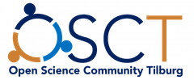

# About

When we worked on our first empirical research project about a decade ago, we honestly didn't have a clue on how to manage data-intensive research projects. Over the years, we found out how cumbersome it could be to be good at stats, but bad at automizing and documenting our work.

We've built up expertise in data preparation and workflow management. And we're eager to pass it on to you - even if you're not enrolled in our class.

Feedback is appreciated always.

## Instructors and Creators

The course is coordinated and instructed by [Hannes Datta](https://hannesdatta.com). Course material, if not indicated otherwise, has been developed by [Hannes Datta](https://hannesdatta.com) and [Roy Klaasse Bos](http://royklaassebos.nl/) from Tilburg University.

## Acknowledgements

In developing this course, we have borrowed from some of the finest (open) content on the web, among others:
* The Turing Way. (2021). [A How To Guide for Reproducible Data Science](https://the-turing-way.netlify.app/welcome)
* Colt Steele. (2020). [Introduction to Git](https://www.notion.so/Introduction-to-Git-ac396a0697704709a12b6a0e545db049)
* Colt Steele. (2020). [Introduction to Github](https://www.notion.so/Introduction-to-GitHub-202af6f64bbd4299b15f238dcd09d2a7)
* Data School. (2014). [Version Control with Git & Github](https://www.youtube.com/watch?v=xKVlZ3wFVKA&list=PL5-da3qGB5IBLMp7LtN8Nc3Efd4hJq0kD)
* Dvorak et al. (2019). [Efficient empiricism: Streamlining teaching, research, and learning in empirical courses](https://doi-org.tilburguniversity.idm.oclc.org/10.1080/00220485.2019.1618765)[^1]

We also rely on access to Datacamp.com.

## Open Science
This course adheres to the principles of the [Open Science Community](https://www.tilburguniversity.edu/research/open-science-community) of Tilburg University. This initiative advocates for transparency and accessibility in research and teaching to all levels of society and thus creating more accountability and impact.

## License

The content on this website and the associated GitHub repository is licensed under a [Creative Commons Attribution-NonCommercial 4.0 International License](http://creativecommons.org/licenses/by-nc/4.0/). In other words, you're invited to contribute to it, or even copy and modify it to suit your needs.

Spread the word about this open education initiative!

## Disclaimer
This website has been generated using the [Tilburg Science Hub Hugo template](https://github.com/tilburgsciencehub/hugo-tiu) for open science and education projects. The content of this website does not necessarily reflect the official policy or position of Tilburg University.

[^1]: Tomas Dvorak, Simon D. Halliday, Michael O’Hara & Aaron Swoboda (2019) Efficient empiricism: Streamlining teaching, research, and learning in empirical courses, The Journal of Economic Education, 50:3, 242-257, DOI: 10.1080/00220485.2019.1618765
