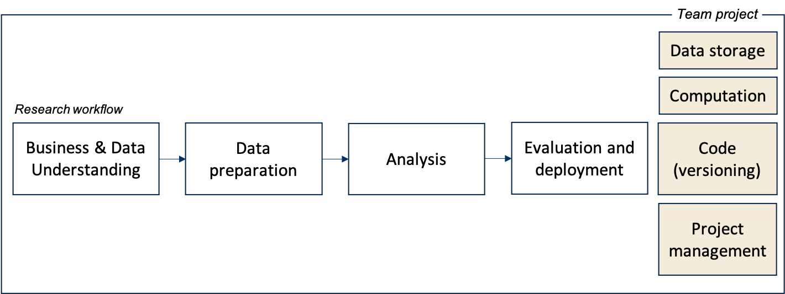

# Modules

The course consists of weekly modules covering the three principles of the *new way of working* (i.e., code, collaborate, automate). In the team assignment, students apply these principles on each stage of an empirical research project.

<!--The first five weeks (including one self-study week) equip you with the skills to work on data-intensive research projects efficiently.

The remaining three weeks are dedicated to working on a team project, in which you put your skills into practice.
-->
 

<!--
## Course structure

- The course consists of 5 modules
- Each module builds up your expertise along one or multiple of the course's learning goals
    - Preparation
      - Prerecorded or live lectures
      - Prerecorded tutorials
      - Live-stream feedback session
    - Activity to implement theory in practice
    - Live-stream feedback session / presentations, etc.
      - Share learnings
    - Advanced content / hangout
      - Discuss advanced issues

- Take in for students: interested in business? interested in academic research? already have some academic research experience? digital meetup

...-->

## Published modules


