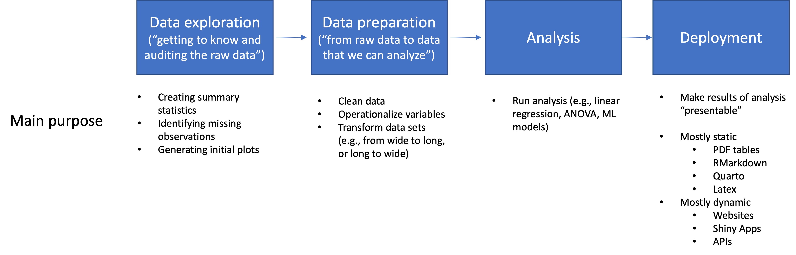
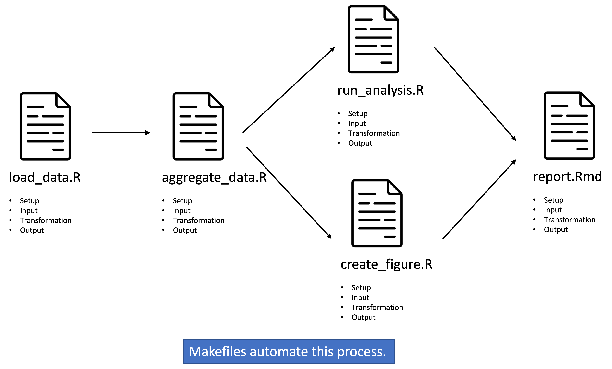
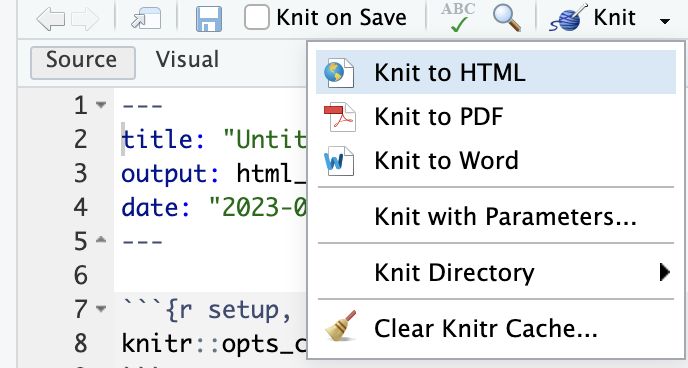
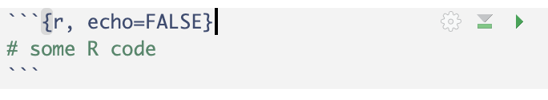

Exploring and auditing new data with RMarkdown (in-class tutorial)
========================================================
author: Hannes Datta
date: 
autosize: true


<style>
.small-code pre code {
  font-size: 1em;
}
</style>

Before we get started
=====================

- Looking back...
  - coaching session: goal to get setup on GitHub
  - tutorial: way of working -- individual/team; issue-based
  - technical issues with Git? see, e.g., [password/authentication](https://dprep.hannesdatta.com/docs/course/support)

Before we get started
====================
incremental: true

- Recap: Git workflow (using our Cheatsheet)
- Example application: contributing to [open source projects](https://github.com/tilburgsciencehub/website) using __forks__ and pull requests (can demonstrate)

- How's your team work going?
  - Let's look at __some__ of your repositories right now
  - __Reality check__: doubting whether to stay enrolled? tell your team how you feel!


<!--  - Ensure teams have their repositories in __GitHub classrooms__ (link on [course site](https://dprep.hannesdatta.com/docs/project))-->

Structure of this tutorial
========================================================

- Data preparation theory ("the bigger picture")

- In-class part of **this week's tutorial**: we will use RMarkdown to start exploring new data

- After class
  - Review today's [tutorial](https://dprep.hannesdatta.com/docs/modules/week3/tutorial/intro-to-r.html). 
  - Work through self-study material
      - [Intermediate R on Datacamp](https://www.datacamp.com/courses/intermediate-r)
      - Data carpentry's [Getting started with R Markdown](https://datacarpentry.org/r-socialsci/06-rmarkdown.html)
    
Data preparation theory (I) - Research workflow
====



Data preparation theory (II): Components of source code
====

1) Initializing the script/setup
- Loading packages
- Making connections to databases
- Knowing whether to prototype or not
2) Input
- Read data (e.g., unstructured/unstructured data, remote/local locations, files or databases)
3) Transformation
- E.g., filtering, aggregation, merging, transformation, deduplication (more later)
4) Output
- Store (intermediate) data, figures (e.g., auditing, final)


Data preparation theory (III): A research pipeline
====



Today's session
===

- Today, we’re “just” exploring data
- ...but, some of the source code will end up in your data preparation for your project.


Exploring data using RMarkdown
==============
incremental: true

- Recall, there are multiple ways to code in R
  - RStudio
  - Your favorite script editor (e.g., VS Code) + running from the terminal
- But -- in all of these cases, the output will be "ugly" (i.e., just some text)
- RMarkdown is a way to format output nicely -- and ideally suited for exploring data
  - mix of code and text (formatted in markdown) - you already know the concept from Jupyter Notebook
  - possibility to compile into HTML, PDF, Word, etc.
- great for prototyping code, but bad for "production" (this is also the case for Python's Jupter Notebook)


DO: Creating your first RMarkdown
=========

In today's session, we create our own RMarkdown document.

1. Select file --> new --> RMarkdown.
2. Choose HTML as output, and pick a good file name (e.g., "tutorial")
3. Try to compile the document by clicking on "knit to HTML". Save your document before first!



__We will continue when you're done.__

RMarkdown basics
======
incremental: true

- We already know markdown syntax, right?
  - If not: find a cheat sheet online right now!
- All compiled the document? Try this first __always__!
- Code cells & running code (click, ctrl/cmd+enter)
- Using inline code
- Options to run (or not run) code cells when compiling documents
  - that 'little wheel'
  - `echo`, `include`
  

Reviewing basic programming concepts in Base R
==============
incremental: true

- Datacamp's Intermediate covers "base R" - basic programming concepts that are at the __core__ of R
- We will first review some of these concepts.
- It's good to have a cheat sheet available - use [this](https://github.com/rstudio/cheatsheets/blob/main/base-r.pdf)

Do: Recap from our bootcamp
================

Let's create some data!


```r
x <- c(10, 20, NA, 5, 3, 100)
```

<br>
__Write code that displays...__

1. all values equal to 10
2. all values NOT equal to 10
3. values larger than 20
4. counts the number of missing values
5. all values larger than 20 OR missing values
6. all values larger than 5 and smaller than 20.

Do: Controls
================

- __If statements__ allow you to conditionally execute some parts of your code.
- Please first download some data - __observe the n_max statement!__


```r
download.file("https://raw.githubusercontent.com/hannesdatta/course-dprep/master/content/docs/modules/week4/regional-global-daily-latest.csv", "streams.csv")
library(tidyverse)
streams <- read_csv('streams.csv', skip=1, n_max = Inf)
```

- __Imagine the data had millions of rows. Write some code that only opens the first 100 rows if a variable called `prototype` is `TRUE`. If `prototype` is `FALSE`, all rows need to be loaded.__

Solution
================


```r
download.file("https://raw.githubusercontent.com/hannesdatta/course-dprep/master/content/docs/modules/week4/regional-global-daily-latest.csv", "streams.csv")
library(tidyverse)

prototype = TRUE
n_max = Inf
if (prototype==TRUE) n_max = 100
streams <- read_csv('streams.csv', skip=1, n_max = n_max)
```

__Beware:__
- `read.csv` is NOT `read_csv` (the latter is more efficient!)
- n_max / nrows (for `read.csv`) are __critically important__!

Why are we doing this again?
=============

Remeber our research workflow? Before we can start with exactly the same data, we all need to download this data set first.

__Question:__ Why not do it manually? What could go wrong?


Loops
=====
class: small-code

- Loops are super handy to execute functions over and over again.


```r
urls = c('http://data.insideairbnb.com/the-netherlands/north-holland/amsterdam/2022-09-07/visualisations/listings.csv', 'http://data.insideairbnb.com/belgium/vlg/antwerp/2022-06-22/visualisations/listings.csv', 'http://data.insideairbnb.com/united-states/nc/asheville/2023-06-18/visualisations/listings.csv')

for (url in urls) {
  filename = paste(gsub('[^a-zA-Z]', '', url), '.csv') # keep only letter
  filename = gsub('httpdatainsideairbnbcom', '', filename) # wipe httpdatainsideairbnbcom from filename
  download.file(url, destfile = filename) # download file
}
```

__Do:__ Use the code snippet from the previous slide to download all historical __listing__ datasets for the city of Barcelona. Check whether files have been saved properly!

Solution
=========

```
# your code here
# urls = # Assemble list of URLs here
# then, copy paste code snippet for downloading and renaming data

```

Loops versus the "apply family"
============
incremental: true

- Loops don't "return" anything - they just execute stuff over and over again
- Functions from the `apply` family, though, DO return information.
- Apply comes in multiple flavors:
  - `lapply` (loops over a `vector` or `list`, returns a `list`)
  - `sapply` (loops over a `vector`, returns as a `vector`)
  - `apply` (loops over rows or columns of a matrix, returns a `vector`)
  - Other versions of `apply` exist, but I rarely use them
- Applies are super handy when working with data

Using `lapply` for crunching data
===========
class: small-code


```r
urls = c('http://data.insideairbnb.com/the-netherlands/north-holland/amsterdam/2023-09-03/visualisations/listings.csv', 'http://data.insideairbnb.com/belgium/vlg/antwerp/2023-06-28/visualisations/listings.csv', 'http://data.insideairbnb.com/united-states/nc/asheville/2023-06-18/visualisations/listings.csv')

datasets <- lapply(urls, read_csv, n_max = 200, col_types=list(neighbourhood='character'))
```

__Do__ 

1. run the code snippet above, and inspect the data. You can enter each data set by typing `datasets[[1]]`, `datasets[[2]]`, etc. - does it correspond to what you would expect?
2. Obtain summary statistics for all data sets, using `lapply` and the `summary`. 
3. Combine all data sets into one, using `bind_rows()`. Can you still correctly identify the name of the original city?

Why again `lapply`?
=========

__What's the key difference between the "apply" family, and for loops?__

Steps in data preparation
================

__Each and every source code file obeys to this procedure__. We called this setup-ITO earlier.


- 1) Setup such as loading packages, setting variables, making database connection
- 2) Input (e.g., loading data)
- 3) Transformation
  - many options...: filtering, grouping and summarizing, creating new variables, etc.
  - mostly leads to a "different primary key than the input data" (--> unit of analysis!)
- 4) Output (e.g., saving, passing on to the next script)

__To do all of this, we require knowledge on new programming concepts.__ So let's continue.

Functions
==========

- Sometimes, we would like to re-use code. For this, we make use of self-made functions. 
- For example, a function that "reduces" the size of the data set to the unit of analysis you're interested in.
- Start by prototyping your function.


```r
my_dataset = datasets[[1]]
my_dataset %>% group_by(neighbourhood) %>% summarize(hosts = n_distinct(host_id))
```

__DO:__

1. Write a function that executes the data aggregation code above, for any dataset it receives as an input. Tip: start with `prep_data <- function(dataset) { # your code here }`
2. Try to test the function on `datasets[[1]]` and `datasets[[2]]`

Solution and extra do's: Functions
=========


```r
prep_data <- function(dataset) {
  my_dataset = dataset %>% group_by(neighbourhood) %>% summarize(hosts = n_distinct(host_id))
  return(my_dataset)
}
prep_data(datasets[[1]])
```

__Now let's continue with some more exercises.__

1. Call the function on _all datasets_ stored in `datasets`, using `lapply`. Save the result in a new variable, called `edited_datasets`.
2. The result still is available in three separate data sets. Can you use the `bind_rows()` function from the `dplyr` package to bind them together? Call it `final_dataset`.

Solution
======


```r
prep_data <- function(dataset) {
  result = dataset %>% group_by(neighbourhood) %>% summarize(hosts = n_distinct(host_id))
  result = result %>% mutate(neighbourhood = as.character(neighbourhood))
  return(result)
}
edited_datasets <- lapply(datasets, prep_data)
final_dataset <- bind_rows(edited_datasets)
```

Some more programming concepts that help us transform data
=========

- Regular expressions are extremely powerful to work with text data -- e.g., neighborhoods, city names, etc.
  - `grepl` can help you filter for information
  - `gsub` helps you to replace information
  

```r
final_dataset %>% filter(grepl('Centrum', neighbourhood))
```

```
# A tibble: 5 × 2
  neighbourhood      hosts
  <chr>              <int>
1 Bijlmer-Centrum        1
2 Centrum-Oost          36
3 Centrum-West          30
4 Historisch Centrum    13
5 Hoboken - Centrum      1
```

__DO__

1. Search for the neighboorhood `de pijp` using `filter` and `grepl`.
2. Search for the `zuidas` using `filter` and `grepl`. Can you make your search case-insensitive?

Summary of concepts covered today
=================

- 


Getting started with exploring data
=====

- We'll make use of the Google mobility dataset 

__DO:__

1. Download the __regional CSV__ from https://www.google.com/covid19/mobility/ & unzip
2. Load the data into R using `read_csv()`
3. Start exploring the data: use `head()`, `tail()`, and `View()`

Summary statistics
========
incremental: true

- We can generate summary statistics using the `summary()` command.
  - do values make sense?
  - are there any missing values?
- We can also zoom in on specific columns
  - let's start making sense of the `retail_and_recreation_percent_change_from_baseline` variable: what does it mean?
  - let's plot this variable over time!
  
Cleaning the data
=========

- Typically, the raw data is always messy and likely not at the correct unit of analysis (e.g., city level).
- Also, we may still want to select columns, or rename them.

<br>
__DO:__

1. Drop these columns: `cols_to_drop <- c('country_region_code', 'metro_area', 'iso_3166_2_code', 'census_fips_code')`
2. Rename `sub_region_1` to `province`, and `sub_region_2` to `city`

We can also use more advanced functions, e.g., to wipe the `percent_change...` from the column names.

Verifying data types
=========

- `class(mobility$date)`
- Can only calculate with dates when they are actual dates!

Do: Selecting subsets
======

- Can you explore the data a bit more? Which observations are measured at the __country level__?
- How can you select only these country-level observations, using `%>% filter(...)`?

Wrapping everything up in a "clean" script
==============

1. Prerequisites loaded?
2. Adhered to input - transformation - output?
3. File callable from the command prompt? --> we will need this for automation in subsequent tutorials


Unit of analysis
===========

- __Unit of analysis__: Fundamental concept in data analysis. Refers to the specific entity or level of observation at which you collect, process, and analyze data. 

- __Why is it important?__ It determines how you aggregate, summarize, and interpret your data. Without knowing your unit of analysis -- at each part of your project -- you will likely get lost.

- __Example__: The `listing` data is at the "city-listing" level. However, we may want to analyze the AirBnB data at the city-listing-date level.


Next steps
===============

- Work through the tutorial and complete exercises (all solutions available)
- Continue working on projects
  - get repository in shape!
  - refine research question & __deployment__
  - explore & prepare datasets for analysis
    - e.g., unit of analysis!
  - adhere to GitHub workflows when collaborating
- ability to score bonus points
