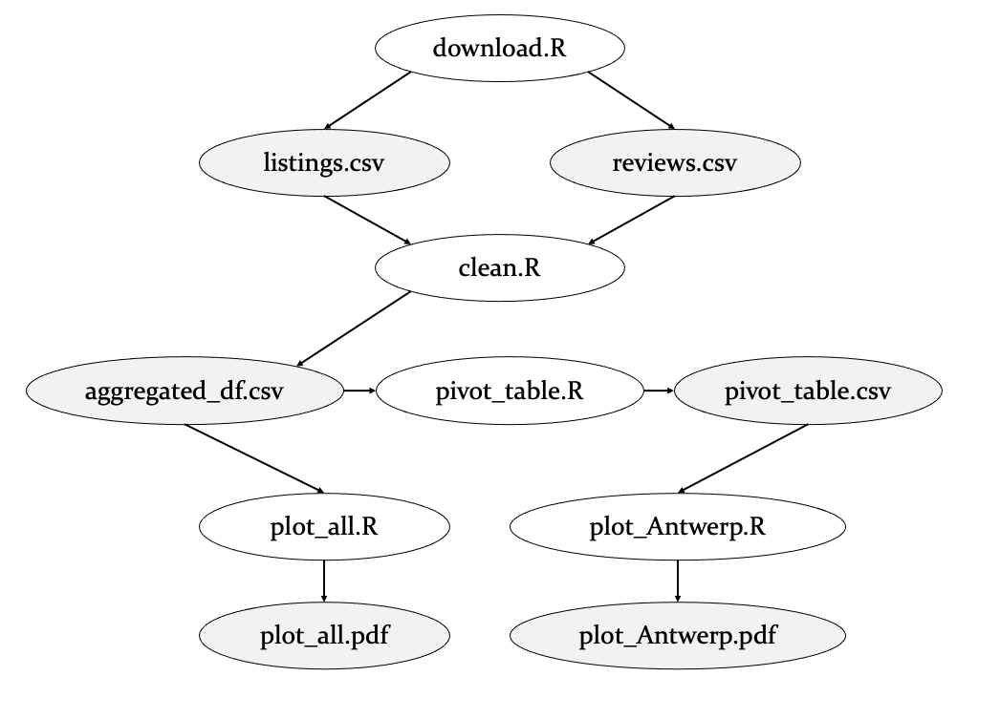

<style>
table {
  width: auto !important;
  margin-left: auto;
  margin-right: auto;
}
</style>


```{r setup, include=FALSE}
knitr::opts_chunk$set(echo = TRUE)
```

---

# Getting started

When working on large-scale data intensive projects, it's important to define a project pipeline and automate it end to end so that you don't have to manually produce your research results but you can just sit back and relax and have the computer do the the job for you. In this tutorial, you learn how to organize your files and directories and set-up a makefile that executes your whole project with just a single command!

## Learning Objectives

* Learn how to organize your project with a coherent directory structure
* Conceive your project as a pipeline
* Separate your code into smaller chunks (each one with inputs, transformations and outputs)
* Automate workflows and make them reproducible using make


## Prerequisites and Installation

* Get familiar with the shell/terminal/command line
  * [DataCamp Introduction to Shell](https://datacamp.com/courses/introduction-to-shell) (chapter 1; Mac &amp; Windows) 
  * [How To Use The Command Line](https://generalassembly.github.io/prework/cl/#/) (optional - only for Mac users)
* Install `make`
  * We will use make to automate the execution of our projects with a "single click", so that our entire work flow is reproducible. Before you proceed, please install make ([Windows](https://tilburgsciencehub.com/get/make) users only - Mac/Linux already have it!).
* Verify whether you installed make successfully  
  * type `make` in the terminal, and confirm with your `enter` key
  * if the computer replies: `make: *** No targets specified and no makefile found.  Stop.` - that means it is *properly installed*!
* Verify you can call R from the command prompt
    - On Mac and Linux, R is available from the command line by default. 
    - Windows users have to add the installation path of R to their environment variable `path`
    - To do so, please follow the steps at the bottom of [this](https://tilburgsciencehub.com/get/r) page.

# Part 1: The Power of Automation

## 1.1 Running files manually
In this tutorial, we're going to create a make file that downloads, loads, transforms, and exports data from [Inside Airbnb](http://insideairbnb.com/index.html). The website provides a visual overview of the amount, availability, and spread of rooms listed on Airbnb across a city, as well as an approximation of the number of bookings and occupancy rate, and the number of listings per host. Moreover, the website publicly shares listings, calendar, neighbourhood and reviews data of various popular Airbnb destinations.  

**Exercise 1**  
As as starting point for this tutorial, we use [source code](https://gist.github.com/hannesdatta/1f764090ae3ebfaabe7a91ea4b971c3d) of an empirical project on the Airbnb housing market in Antwerp.

1. Download the source code as `run_Antwerp.R`, open the file in RStudio, and run it. What output files does it return?
2. Makefiles trigger scripts (e.g., R files) from the terminal and therefore it is important to know how to do so. Open the terminal and navigate to the location where the R script is stored. Then, run `R --vanilla < run_Antwerp.R` to execute the same file but this time from the terminal (depending on your installation you may need to run `Rscript run_Antwerp.R` instead). 

The lesson learned here is that we cannot only run R scripts from within RStudio but also from the terminal. We'll use this knowledge when creating our first make file. 

\

## 1.2 Automation with `makefiles`

### 1.2.1 What are makefiles?

Makefiles are instructions (“rules”) for a computer on how to build “stuff”. Think of makefiles as a recipe you may know from cooking (“Baking a cake: First, take some flour, then add milk […]") - but then for computers.

Makefiles originate in software development, where they have been used to convert source code into software programs that can then be distributed to users.

Researchers can use makefiles to define rules how individual components (e.g., cleaning the data, running an analysis, producing tables) are run. When dependencies (e.g., to run the analysis, the data set first has to be cleaned) are well-defined, researchers can completely automate the project. When making changes to code, researchers can then easily “re-run” the entire project, and see how final results (potentially) change.

\

### 1.2.2 Rules (or "recipes")

A rule in a makefile generally looks like this:

```
targets: prerequisites
   commands to build
```

* The __targets__ are things that you want to build - for example, data sets, outputs of analyses, a PDF file, etc. You can define multiple targets for one rule (separate targets by spaces!). Typically, though, there is only one per rule.
  * Example: `plot_all.pdf`

* The __prerequisites__ are the things that you *need* before you can build the target. It's also a list of file names, separated by spaces. These files need to exist before the commands for the target are run. They are also called dependencies. The cool thing is that `make` automatically checks whether any of the dependencies has changed (e.g., a change in the source code) - so it can figure out which rules to be run, and which ones not (saving you a lot of computation time!).
  * Example: `run_Antwerp.R` (before building `plot_all.pdf`, the R script need to exist)

* The __commands__ are a series of steps to go through to *build* the target(s). These need to be indented with a tab ("start with a tab"), *not* spaces.
  * Example: the command `R --vanilla < run_Antwerp.R` opens R, and runs the script `run_Antwerp.R`.
  
Taken together, the makefile could look like this: 
```
plot_all.pdf: run_Antwerp.R
  R --vanilla < run_Antwerp.R
```


### 1.2.3 Implementing a Simple Makefile

**Exercise 2**  

1. Create a new makefile (tip: if you're on a Mac or Linux machine, use `touch makefile` in your terminal; Windows users can open a new file in an editor and save it (without file extension!) as `makefile`). Open the `makefile` in a text editor. Add the two lines above and save the changes. Open your terminal and run `make`. What happens?  
2. Type `make` again. What does it say, why is that?  
3. On line 64 and 75 change the `Universiteitsbuurt` column to `Stadspark` and save the file. Run `make -n` (to preview the changes) and then type `make` to actually do it. Does it run this time, why?


```{markdown, webex.hide = 'Solution to Exercise 2'}

1. You probably got the following error: `make: *** No targets specified and no makefile found.  Stop.`. This is because command (in line 2 of the makefile) required to build the target needs to be indented with a tab ("start with a tab"), not spaces. Modify that line by adding a tab instead and re-run. 
2. Now `make` should run without any issues. It will execute the command in the makefile and create the `plot_all.pdf` file. 
3. `make` detects changes in the source code to build the target (plot_all.pdf) and therefore it runs the **entire** file again. This is not computationally efficient as the data has already been downloaded and cleaned. We will address this in the next exercise.

```

# Part 2: Modularization & Directory Structure

## 2.1 Modularizing Code
So far, we have defined a simple makefile that checks whether `plot_all.pdf` is present and if not it runs the R script. For each minor change, such as changing one of the areas in the plot, it runs the entire script from top to bottom. This costs unnecessary compute resources because the listings and reviews data have already been downloaded and preprocessed. In practice, you therefore often want to split up a large file into multiple *modules* so that you only need to run those modules that contain changes. 

In the figure below we impose a flow diagram structure in which the `run_Antwerp` script has been split up in five separate R modules: 

* `download.R` = downloads the raw listings and review data from Inside Airbnb.
* `clean.R` = merges, preprocesses, and aggregates the data into a dataframe and writes it to `aggregated_df.csv`.
* `pivot_table.R` = generates a pivot table in which the columns are the city neighborhoods.
* `plot_all.R` = aggregate the number of reviews across all neighborhoods and create a plot.
* `plot_Antwerp.R` = create a line chart for three neighborhoods in Antwerp (Universiteitsbuurt, Sint Andries, Centraal Station).

{width=50%}


**Exercise 3**    
a. Split up the full R script into the 5 separate scripts according to the diagram and definitions above. The sections indicated by comments (e.g., ### CLEAN DATA) serve as potential split-off points.   
b. Check if all scripts run without issues. If not, make the necessary changes (tip: check if the libraries are imported at the top of each file).  
c. Redefine the dependencies in make for the targets `reviews.csv`, `listings.csv`, `aggregated_df.csv`, `pivot_table.csv`, `plot_Antwerp.pdf`, and `plot_all.pdf` so that workflow dependencies are triggered like a chain reaction. For example, `plot_all.pdf` requires `aggregated.pdf.csv` to be there which in turn requires `listings.csv`, `reviews.csv` and `clean.R`. Use the figure above to identify the prerequisites and command files. 
d. Delete the targets that were built in the last iteration. Now run `make -n` and `make` and see what happens. Does it work as expected? 

```{makefile, webex.hide = 'Solution to Exercise 3c'}
listings.csv reviews.csv: download.R
	R --vanilla < download.R

aggregated_df.csv: clean.R
	R --vanilla < clean.R
	
pivot_table.csv: pivot_table.R
	R --vanilla < pivot_table.R
	
plot_Antwerp.pdf: plot_Antwerp.R
	R --vanilla < plot_Antwerp.R
	
plot_all.pdf: plot_all.R
	R --vanilla < plot_all.R
```
```{markdown, webex.hide = 'Solution to Exercise 3d'}
You will see that `make` only builds the first target by default. Next we show you how to use phony targets so that it executes all commands!
```

## 2.2 Phony targets
The targets we have seen so far refer to output files (e.g., `aggregated_df.csv`). Sometimes, it’s not practical to generate outputs. We call these targets "phony targets". Let's consider the following makefile: 

```
all: one two

one:
	touch one.txt

two:
	touch two.txt
```

Neither `one` and `two` are output files; they are phony targets that create two text files. The phony target `all` at the top calls both targets. Think of it as a "meta rule" to build it all!


**Exercise 4**  
Create another directory (let's call it "test-phony") and add a makefile with the same contents as above (make sure to add tabs instead of space before the commands used to build targets!). Change your working directory to this folder `test-phony` annd run `make` and see what happens. Then remove all text files and run `make one`, what happens this time? 

```{markdown, webex.hide = 'Solution to Exercise 4'}
When you first run `make` it builds the two targets `one.txt` and `two.txt` files in the directory. Next, when you run `make one`, it builds the target called "one" and creates the `one.txt` file alone.
```

We can apply the same principle and add the following `all` target to our makefile:
```
all: plot_Antwerp.pdf plot_all.pdf aggregated_df.csv pivot_table.csv listings.csv reviews.csv
```
**Exercise 5a**  
Switch back to the other directory, add the `all` phony target to your makefile, and run `make`. What happens? Does it create all targets this time? 

```{markdown, webex.hide = 'Solution to Exercise 5a'}
After updating the first line with all the targets as specified above, when you run `make` it will fail to build the first target `plot_Antwerp.pdf` and renders the following error message:

**Error: 'pivot_table.csv' does not exist in current working directory**

This is because it is missing a key prerequisite pivot_table.csv. So order of the targets matters! To fix this, you need to change the order of the targets in the `all` phony target and your updated makefile should look like this:

```

```{makefile, webex.hide = 'Makefile solution to Exercise 5a'}
all: listings.csv reviews.csv aggregated_df.csv pivot_table.csv plot_Antwerp.pdf plot_all.pdf

listings.csv reviews.csv: download.R
	R --vanilla < download.R

aggregated_df.csv: clean.R
	R --vanilla < clean.R
	
pivot_table.csv: pivot_table.R
	R --vanilla < pivot_table.R
	
plot_Antwerp.pdf: plot_Antwerp.R
	R --vanilla < plot_Antwerp.R
	
plot_all.pdf: plot_all.R
	R --vanilla < plot_all.R

```

**Exercise 5b**  
Would it make a difference if you left the four csv files in the all target, why is that? Delete all the targets built in the last iteration and run `make` again. What happens this time?

```{markdown, webex.hide = 'Solution to Exercise 5b'}
Yes, it would make a difference. If you list the four CSV files (reviews.csv, listings.csv, aggregated_df.csv, pivot_table.csv) under `all` targets, `make` will explicitly check them, and if any are missing or outdated, it will rebuild them and all subsequent dependencies. If the CSV files are already present and up-to-date, make will skip them and proceed to build the next targets (plot_Antwerp.pdf and plot_all.pdf), if necessary. If you do not include them under `all`, `make` might skip rebuilding them, even if they are missing, because no rule explicitly requires them as a starting point and the workflow breaks due to missing dependencies.
``` 

## 2.3 Directory Structure
Part of building a proper data pipeline is having a directory structure in place. Up to this point, we did not explicitly tell you where or how to save your files so you probably stored all source and output files in a single folder. Especially for larger projects this tends to become messy, so instead we recommend having a structured mechanism in place for your file storage, which we explain below.

To start, let’s assume we’re working on a project, called `my_project`. Let us create that directory somewhere on our computer, preferably not in the cloud (i.e., not in a Dropbox or Google Drive folder). Inside this folder you find the following subdirectories: 

**`data`**  
Raw data gets downloaded into the data folder of your project (`my_project/data`) from either a network drive, or a remote file storage that is securely backed up.

**`src`**  
Source code is made available in the `src` folder of your main project: `my_project/src/`. Create subdirectories for each stage of your pipeline: 
  * `data-preparation`: clean a dataset
  * `analysis`: analyze the data cleaned in the previous step
  * `paper`: produce tables and figures for the final paper. 
  
The directory structure for the `src` directory thus becomes: 
```
/src/data-preparation/
/src/analysis/
/src/paper/

```

**`gen`**  
Generated files are stored in the gen folder of your main project: `my_project/gen/`. You can use subdirectories that match your pipeline stages to further bring structure to your project:

  * `input`: This subdirectory contains any required input files to run this step of the pipeline. Think of this as a directory that holds files from preceding modules (e.g., the analysis uses the file exchange to pull in the dataset from its preceding stage in the pipeline, /data-preparation).

  * `temp`: These are temporary files, like an Excel dataset that needed to be converted to a CSV data set before reading it in your statistical software package.

  * `output`: This subdirectory stores the final result of the module. For example, in the case of a data preparation module, you would expect this subdirectory to hold the final dataset. In the case of the analysis module, you would expect this directory to contain a document with the results of your analysis (e.g., some tables or figures).

\

**Exercise 6**  
1. Add a `src` folder in which you create two subdirectories: `data-preparation` and `analysis`. Note that you don't need to create a `data` and `gen` folder as the makefile will take care of that later.  
2. Store the five R scripts you created earlier in the correct subdirectory: 
```
/src/data-preparation/
  - download.R
  - clean.R
/src/analysis/
  - pivot_table.R
  - plot_all.R
  - plot_Antwerp.R
```
3. In the original R script all files were loaded and exported in the working directory (i.e., folder in which the full script was located). Since we set-up a new directory structure, we need to update the file paths. Make sure your R files satisfy the criteria below: 
  * `download.R` should store the data inside the `data` folder (even though it's been not been created yet).
  * `clean.R` should load the review and listings data from the `data` folder and store the output in `gen/temp`.
  * `pivot_table.R` should load `aggreagated_df.csv` from `gen/temp` and export the pivot table in `gen/temp`. 
  * `plot_all.R` should load `aggreagated_df.csv` from `gen/temp` and export the plot into `gen/output`.
  * `plot_Antwerp.R` should load `pivot_table.csv` from `gen/temp` and export the plot into `gen/output`.
  
Tip: keep in mind that all file paths are relative to the current storage location. For example, from `download.R` inside `src/data-preparation` to the `data` folder requires two steps back and one change of directories (i.e., `../../data`).
  

**Exercise 7**  
Not only the file paths in the R scripts changed by moving the files to different directories, but also the relative paths in the make file are no longer up to date. Make the necessary changes to the targets, commands, and prerequisites and then try running `make -n` to see whether it works as expected.

Tip: Add `Rscript -e "dir.create('data')"` as a command above `download.R` in the makefile so that it first creates the data folder before it tries to store the downloaded data there. If you forget to do this and you didn't create the folder manually, it will throw an error once it attempts to save a file in the unknown folder. Do the same for the `gen/temp` and `gen/output` subfolders.

```{makefile, webex.hide = 'Solution to Exercise 7'}
# Main target
all: dirs data/listings.csv data/reviews.csv gen/temp/aggregated_df.csv gen/temp/pivot_table.csv gen/output/plot_Antwerp.pdf gen/output/plot_all.pdf

# Create necessary directories using Rscript
dirs: data_dir temp_dir output_dir

data_dir:
	Rscript -e "if (!dir.exists('data')) dir.create('data', recursive = TRUE)"

temp_dir:
	Rscript -e "if (!dir.exists('gen/temp')) dir.create('gen/temp', recursive = TRUE)"

output_dir:
	Rscript -e "if (!dir.exists('gen/output')) dir.create('gen/output', recursive = TRUE)"

# Step 1: Download data
data/listings.csv data/reviews.csv: src/data-preparation/download.R 
	Rscript src/data-preparation/download.R

# Step 2: Clean data
gen/temp/aggregated_df.csv: src/data-preparation/clean.R ../../data/listings.csv ../../data/reviews.csv 
	Rscript src/data-preparation/clean.R

# Step 3: Create pivot table
gen/temp/pivot_table.csv: src/analysis/pivot_table.R ../../gen/temp/aggregated_df.csv 
	Rscript src/analysis/pivot_table.R

# Step 4: Plot Antwerp
gen/output/plot_Antwerp.pdf: src/analysis/plot_Antwerp.R ../../gen/temp/pivot_table.csv 
	Rscript src/analysis/plot_Antwerp.R

# Step 5: Plot All
gen/output/plot_all.pdf: src/analysis/plot_all.R ../../gen/temp/aggregated_df.csv 
	Rscript src/analysis/plot_all.R
```
For better structure, we can define the creation of directories as a separate target ('dirs') as shown above. 


# Part 3: Advanced Commands

## 3.1 Variables

Writing long file paths, such as `../../gen/temp/aggregated_df.csv` is cumbersome and prone to errors. Therefore, you can clean up your makefiles using variables like this: 
```
TEMP = ../../gen/temp
DATA = ../../data

gen/temp/aggregated_df.csv: $(DATA)/listings.csv $(DATA)/reviews.csv clean.R
    R --vanilla < clean.R
```
In other words, you specify the file path as a variable at the top (e.g., `TEMP = ...`) after which you can reference it with `$(VARIABLE)`. 


**Exercise 8**  
Adapt your makefile from exercise 7 such that repetitive paths are replaced by variables.

```{makefile, webex.hide = 'Solution to Exercise 8'}
# Main target
all: dirs data/listings.csv data/reviews.csv gen/temp/aggregated_df.csv gen/temp/pivot_table.csv gen/output/plot_Antwerp.pdf gen/output/plot_all.pdf

# Create necessary directories using Rscript
dirs: data_dir temp_dir output_dir

data_dir:
	Rscript -e "if (!dir.exists('data')) dir.create('data', recursive = TRUE)"

temp_dir:
	Rscript -e "if (!dir.exists('gen/temp')) dir.create('gen/temp', recursive = TRUE)"

output_dir:
	Rscript -e "if (!dir.exists('gen/output')) dir.create('gen/output', recursive = TRUE)"

DATA = ../../data
TEMP = ../../gen/temp
# Step 1: Download data
data/listings.csv data/reviews.csv: src/data-preparation/download.R 
	Rscript src/data-preparation/download.R

# Step 2: Clean data
gen/temp/aggregated_df.csv: src/data-preparation/clean.R $(DATA)/listings.csv $(DATA)/reviews.csv 
	Rscript src/data-preparation/clean.R

# Step 3: Create pivot table
gen/temp/pivot_table.csv: src/analysis/pivot_table.R $(TEMP)/aggregated_df.csv 
	Rscript src/analysis/pivot_table.R

# Step 4: Plot Antwerp
gen/output/plot_Antwerp.pdf: src/analysis/plot_Antwerp.R $(TEMP)/pivot_table.csv 
	Rscript src/analysis/plot_Antwerp.R

# Step 5: Plot All
gen/output/plot_all.pdf: src/analysis/plot_all.R $(TEMP)/aggregated_df.csv 
	Rscript src/analysis/plot_all.R
```

## 3.2 Multiple makefiles

Up to now, we have created a single makefile stored in the root directory that triggers the entire workflow. For clarity and structure reasons, however, it is recommended to have a makefile in both the `data-preparation` and `analysis` subfolder. This also makes referencing file paths to the files more straightforward. 

Therefore, we create two makefiles so that you end up with the following file structure: 
```
/src/data-preparation/
  - download.R
  - clean.R
  - makefile
/src/analysis/
  - pivot_table.R
  - plot_all.R
  - plot_Antwerp.R
  - makefile
```

**Exercise 9a**   
Create the makefile in `src/data-preparation`, copy the related make commands from the makefile in the root directory, and add an `all` phony target to both makefiles. Don't forget to include the `R -e "dir.create('directory_name')"` commands and double check relative paths! Change your working directory to `src/data-preparation` to test this makefile by running `make`.

```{makefile, webex.hide = 'Solution to Exercise 9a'}
DATA = ../../data
TEMP = ../../gen/temp

# Main target
all: dirs $(DATA)/listings.csv $(DATA)/reviews.csv $(TEMP)/aggregated_df.csv
# Create necessary directories using Rscript
dirs: data_dir temp_dir output_dir

data_dir:
	Rscript -e "if (!dir.exists('../../data')) dir.create('../../data', recursive = TRUE)"

temp_dir:
	Rscript -e "if (!dir.exists('../../gen/temp')) dir.create('../../gen/temp', recursive = TRUE)"

output_dir:
	Rscript -e "if (!dir.exists('../../gen/output')) dir.create('../../gen/output', recursive = TRUE)"

# Step 1: Download data
$(DATA)/listings.csv $(DATA)/reviews.csv: download.R 
	Rscript download.R

# Step 2: Clean data
$(TEMP)/aggregated_df.csv: $(DATA)/listings.csv $(DATA)/reviews.csv clean.R 
	Rscript clean.R
```

**Exercise 9b**   

Create the makefile in `src/analysis`, copy the related make commands from the makefile in the root directory, and add an `all` phony target to both makefiles. Don't forget to include the `R -e "dir.create('directory_name')"` commands and double check relative paths! Change your working directory to `src/analysis` to test this makefile by running `make`.

```{makefile, webex.hide = 'Solution to Exercise 9b'}
DATA = ../../data
TEMP = ../../gen/temp
OUTPUT = ../../gen/output
# Main target
all: dirs $(TEMP)/pivot_table.csv $(OUTPUT)/plot_Antwerp.pdf $(OUTPUT)/plot_all.pdf

# Create necessary directories using Rscript
dirs: temp_dir output_dir

temp_dir:
	Rscript -e "if (!dir.exists('../../gen/temp')) dir.create('../../gen/temp', recursive = TRUE)"

output_dir:
	Rscript -e "if (!dir.exists('../../gen/output')) dir.create('../../gen/output', recursive = TRUE)"

# Create pivot table
$(TEMP)/pivot_table.csv: $(TEMP)/aggregated_df.csv pivot_table.R
	Rscript pivot_table.R

# Plot Antwerp
$(OUTPUT)/plot_Antwerp.pdf: $(TEMP)/pivot_table.csv plot_Antwerp.R
	Rscript plot_Antwerp.R

# Plot All
$(OUTPUT)/plot_all.pdf: $(TEMP)/aggregated_df.csv plot_all.R
	Rscript plot_all.R
```

**Exercise 10**  
Run `make -n` in `src/analysis` and `src/data-preparation` separately and see whether it works as expected. Then, manually remove the `data` and `gen` folders and try to regenerate all files. How many times do you have to run `make`? 

```{markdown, webex.hide = 'Solution to Exercise 10'}
You have to run make twice. First, go to `src/data-preparation` and run `make; then switch to `src/analysis` and run make to complete the workflow.
```

While having multiple makefiles creates structure and clarity, you don't want to run `make` in each and every folder (especially if the number of subfolders grows). Fortunately, you can have a makefile in your root directory that triggers other makefiles. Here's how the syntax looks like in our case: 

```
all: analysis data-preparation

data-preparation:
	make -C src/data-preparation

analysis: data-preparation
	make -C src/analysis
```

There are two phony targets (`data-preparation` and `analysis`), each with the `make -C` command and a reference to the folder in which the makefile is stored.

**Exercise 11**  
Create another makefile in the root directory, copy the contents from above, and run `make` again. Does it work as expected? How many times do you have to run `make` this time?
Tip:  Don't forget to add `tabs` before the commands in the makefile!
```{makefile, webex.hide = 'Solution to Exercise 11'}
all: analysis data-preparation

data-preparation:
	make -C src/data-preparation

analysis: data-preparation
	make -C src/analysis

```
This time, you only have to run `make` once from the root directory to trigger the entire workflow!

## 3.3 Cleaning data
Like the `all` phony target generates all files, another convention is to have a `clean` target that removes all generated folders and files. This way, you can easily clean up your directory and run `make` again to build up all files from scratch. The code snippet below removes the `data` and `gen` folders as well as their contents.

```
clean:
	R -e "unlink('data', recursive = TRUE)"
	R -e "unlink('gen', recursive = TRUE)"
```

**Exercise 12**  
Add the `clean` phony target to the makefile located in the root directory. Then, run `make clean` to trigger it. Does it work as expected? Finally, run `make` again to generate the temporary files and plots again.

```{makefile, webex.hide = 'Solution to Exercise 12'}
all: analysis data-preparation

data-preparation:
	make -C src/data-preparation

analysis: data-preparation
	make -C src/analysis

clean:
	R -e "unlink('data', recursive = TRUE)"
	R -e "unlink('gen', recursive = TRUE)"
```

# FAQ

Creating a make workflow that runs from start to finish is an iterative process of trial and error. Here are a few pointers to debug your makefiles.

## 1. Is `make` properly installed?*

  To run makefiles, you have to have `make` installed on your system. So if you see a message like this... `'make' is not recognized as an internal or external command, operable program or batch file.`.

  ...head over to Tilburg Science Hub [to see how to install `make`](https://tilburgsciencehub.com/get/make).


## 2. Does your code run without make?*

  There are two things that can go wrong when working with makefiles. Either there's a problem with the `makefile` itself, or there's a problem with the code that the `makefile` executes.

  So, a first check is to copy-paste the commands to build (e.g., `python script.py` or `R --vanilla < script.R`) into the console, and see whether the Python or R code runs as expected. 


  Does the script run? Then you need to debug your makefile (see next). If it doesn't run, first try to debug your source code in R/Python etc. 
  
  For example, it may happen that you get the following error: `dyld: Library not loaded: @rpath/libreadline.6.2.dylib` which means that make could not find the R installation. Using `Rscript` as opposed to `R --vanilla <` may solve the issue. Alternatively, specify the full path to your R installation to make sure it looks for the R library in the right place (e.g., define `Rscript = /Library/Frameworks/R.framework/Versions/4.0/Resources/bin/Rscript` at the top and use `$(Rscript) script.R` to execute the code thereafter). 

\

## 3. Is your `makefile` structured properly?*

  One of the most common mistakes in a `makefile` is to not adhere to the syntax:

  ```
  source: prerequisites [separated by spaces]
     COMMANDS TO RUN
  ```

  The commands need to be separated by a tab character. Try to open the makefile in another editor, and verify that you have correctly made use of the tab. Note that some editors replace tabs by spaces (and you don't want that here or it will raise an error: ` *** missing separator.`!).
  
