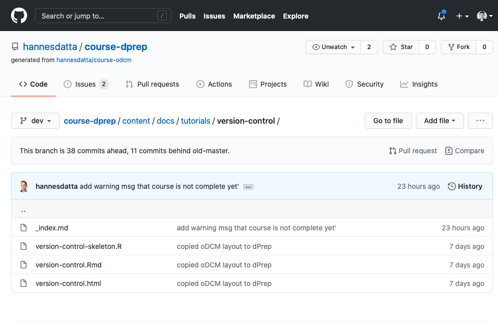
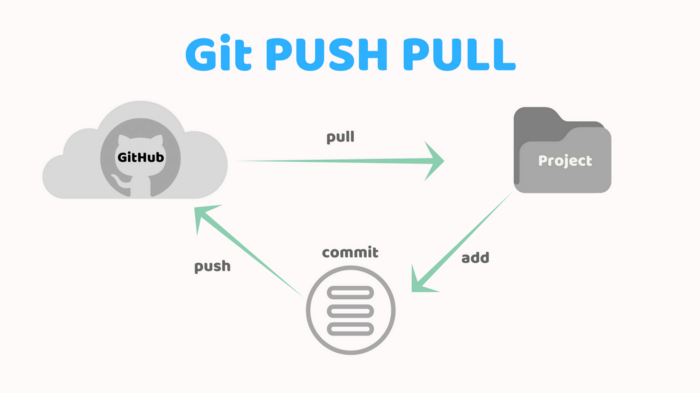

```{r setup, include=FALSE}
knitr::opts_chunk$set(echo = TRUE)
```

*For your group projects, you have probably used a tool like Google Drive or Dropbox to share your work with others. Although you could theoretically share your R files using these tools, it has a few limitations  when it comes to version control. For example, how can you easily return to a previous version of your work? Or what happens once your friend and you are overwriting each others' code? In this tutorial, we'll introduce you to Git and Github and learn you to streamline your collaboration workflows!*

---

### Prerequisites
* [DataCamp Introduction to Shell](https://learn.datacamp.com/courses/introduction-to-shell) (chapter 1; Mac & Windows) 
* [How To Use The Command Line](https://generalassembly.github.io/prework/cl/#/) (optional - only for Mac users)


--- 


### Learning Objectives
* Set-up Git and Github
* Apply the end-to-end Git Workflow (add, commit, push)
* Restore to an earlier version
* Create branches and switch to another branch
* Collaborate on projects with others using Github


--- 


### Submission 
Students are expected to hand in a digital copy of their answers and code according to the [submission guidelines](https://dprep.hannesdatta.com/#submission-guidelines). 


--- 


### 1. Basic Git Workflow


#### 1.1 What is version control? 
Every time you make a change in a Google Docs file, the system keeps track of your changes, and you can always return to an earlier version of your work. Git provides similar functionality specifically built for code and is therefore a popular version control system among data analysts and data scientists. It helps you to understand what changes you made in the past, why you did a specific analysis even weeks or months later. In other words, you make your analysis *reproducible* which is good scientific practice.

{width=60%}

\

Gits most important features are: 

* Nothing that is saved to Git is ever lost, so you can always go back to see which results were generated by which versions of your programs. So you never have to worry about overwriting and losing your work. We know the struggle: `assignment.docx`, `assignment-final.docx`, `assignment-final-FINAL.docx`...

* Workflows can be separated into so-called branches which allow you to have multiple versions of your work and work on several things at once.

* It's highly useful in a team environment because everyone can work independently on the same files. Since there is a permanent record of who made the change, you can easily trace back each others' contributions. 

* It automatically notifies you when your work conflicts with someone else's. For example, say that for your group assignment you wrote the following in an R Markdown file `In this assignment, we explore...`, whereas your classmate who was working on the assignment at the same time wrote `The goal of this assignment is to...`, Git will inform you about a so-called merge conflict once you try to combine versions of your work. In other words, it allows you to easily compare two versions side-by-side and makes sure that you don't accidentally overwrite each others' work.

\

#### 1.2 Difference between Git and Github

**Importance**  
One of the learning goals is defined as *"Setup Git and Github"*. So you may wonder: what's the difference between them? After all, both of them have the phrase "Git" in it, right? 


*Git* is a system for version control primarily used by programmers. It runs on the command line of your local machine (for Mac and Windows users the Terminal and Git bash, respectively). It allows you to keep track of your files and modifications to those files in something called a repository (or repo) which contains all project files and the code history. 

So here's an example of what working in Git may look like: a terminal that tells me that I made 3 modifications and added 1 folder (`images/`) that has not been tracked by Git yet. Don't worry if you don't fully understand this, we'll go over each of these commands in a bit.

{width=50%}

\

*GitHub* is a website that allows you to upload your Git repositories online. It provides a back-up of your files, has a visual interface for navigating your repositories on the internet, gives others a way to navigate your repositories, and makes collaboration easy. In a way, it could be looked at as a social networking website for developers. Users can follow each other, give ratings, collaborate, and communicate. Developers often use it to publish their project portfolio online because it's an easy way to showcase their skills and experience to potential employers.

Below, you find a screenshot of the Github repository where this very [file](https://github.com/hannesdatta/course-dprep/tree/dev/content/docs/tutorials/version-control) (`version-control.Rmd`) is hosted. It shows a folder structure just like the Mac and Windows file explorer. You can click on any folder to see the contents. These repositories can either be public or private (like Google Drive).


{width=50%}
\

In summary, we can say that: 

* Git is the version control system, the tool that tracks changes to our files over time.

* Github is a hosting service for projects that use Git.

\

**Let's try it out!**  
Create a [Github account](https://github.com/join?ref_cta=Sign+up&ref_loc=header+logged+out&ref_page=%2F&source=header-home) (we recommend using your university email!), log in, and navigate towards the [course repository](https://github.com/hannesdatta/course-dprep). Browse through the files and get a feeling for all the tabs and buttons (no worries: you can't break anything :-). Try to get an answer for each of the questions:

1. Who is the creator of the repository? What happens once you click on his username? 
2. When was the repository last updated? 
3. What do the brief text messages next to the files and folder relate to? 
4. Where can you find the `tutorial` folder? 
5. What happens if you "star" a repository? And what does that actually mean?
6. What happens once you switch to another branch? (e.g., `dev`)
7. Can you find a way to see how the first version (also known as "first commit") of the repository looked like? 
 
\
 
#### 1.3 Create a New Repository

In this step-by-step tutorial, we're going to create a new repository and copy it to our local computer. Note that Github also offers a [graphical tool](https://desktop.github.com/) to work with Git, yet we strongly recommend sticking to the command line as it helps you to get a better understanding of how all concepts fit together.  

1. Download and install the latest version of [Git](https://git-scm.com/downloads) (Mac users first need to install [homebrew](https://brew.sh/)).  

2. Head over to [Github](https://github.com/) (the website) and click on the "+" symbol in the top right corner to create a new repository. Give it the name `version-control-exercises`, keep it public, and check the box that says add a README file:


<center>{width=50%}</center>
\

3. The `README.md` file is a special markdown file in the root directory of the repository. Everything in that file automatically renders on the home page of the repository. You should think of it as a way to communicate to others what's in the repository, and how they can run your code (e.g., see the example in the [course repository](https://github.com/hannesdatta/course-dprep)). Currently, your README is still blank (except for the title), but we can easily change that directly from our browser. Click on the pencil icon in the top right corner of the README to edit the file and add a few lines to it. Like R Markdown, you can use the same syntax for formatting (e.g., **bold**, *italics*, etc.). 

\

4. At the bottom of the page, you find two fields near the "Commit changes" subheader. The first field is required and asks you to give a very short description of the changes you have made. The second field is optional and can be used to provide some more details if you made a lot of changes. The idea here is that you can later go back to an earlier version, and these descriptions help you distinguish between the different versions of the file. Once you're done, click on "Commit changes". Congratulations! You have now created a repository, including a README file, and created your first commit on GitHub.

\

<center>{width=50%}</center>

\

5. Your repository should now render the updated version of your README file. It only exists on GitHub though, not on your local computer. Therefore, we're now finally going to copy the folder to our machine. First, open up Git Bash (Windows) or the Terminal (Mac) and change your working directory to the folder where you store the files for this course (need a reminder on how to do that? Revisit chapter 1 of [this](https://learn.datacamp.com/courses/introduction-to-shell) online course). Second, type `git clone <URL repo>` (basically download) where you can find the HTTPS URL (not the SSH one!) in your repository. In case git asks for your passphrase, fill out the password of your Github account. It has now copied the repo `version-control-exercises` (incl. all commit history) to your local machine. 

\

<center>{width=60%}</center>

\

6. Open the folder and check whether the `README.md` contains the changes you made in your latest commit. 

\

Note that in this exercise, you have been working with a pre-existing repository (you first created it on Github and then cloned it to your local machine). If you, however, want to create a repository for a new project in the current working directory (e.g., a project you were already working on but did not use Git for), you can simply run `git init <folder>` in the folder you want to be the root directory to initialize a new Git repository.

\

#### 1.4 Committing Changes  

**Importance**  
Git does not track files by default. Instead, it waits until you explicitly tell it to pay attention to a file. This also means that the untracked files won’t benefit from version control. The `git status` command gives you an overview of files in your repository that aren't yet being tracked. 

\

{width=40%}

\

First, we add files from the working directory to the staging area. That is, a temporary place for files with saves that haven't been saved yet. To add a file to the staging area use 

```
git add <filename>
```
Alternatively, run `git add .` if you want to stage *all* files in the working directory in one go. You, however, don’t have (and want) to put all of the changes you have made recently into the staging area at once. For example, suppose you are adding a feature to `data_preparation.R` and spot a bug in `data_analysis.R`. After you have fixed it, you want to save your work. Since the changes to `data_preparation.R` aren't directly related to the work you’re doing in `data_analysis.R`, you should save your work in two separate commits. 

Thus, commits should be 'atomic', meaning that they should do one simple thing and they should do it completely. If a lot of different changes to your project are all committed together, it can be hard to troubleshoot if any error appears in that version. 

As you keep saving your work by adding changes, you make more and more snapshots. You can think of these as saving versions of these files while documenting their history. To save the changes in the staging area you use the command:
```
git commit -m "<commit message>"
```
Git requires you to enter a `commit message` (like you previously did for the `README.md` file!). For example, `git commit -m "add function to clean trailing spaces"`. This serves the same purpose as a comment in a program: it tells the next person to examine the repository why you made a change. 

Creating insightful and descriptive commit messages is one of the best things you can do to get the most out of version control. It lets people (and your future self when you have long since forgotten what you were doing and why) quickly understand what updates a commit contains without having to carefully read code and waste time figuring it out. 

A good commit message should explain what you did, why you did it, and what is impacted by the changes. As with comments, you should describe what the code is "doing" rather than the code itself. For example, it is not obvious what `change s to 1000` actually does, but `increased sample size to 1000` is clear.

If you run git commit without the `-m "<commit message>"` part, Git launches a text editor with a template like this:

```
# Please enter the commit message for your changes. Lines starting
# with '#' will be ignored, and an empty message aborts the commit.
# On branch master
# Your branch is up-to-date with 'origin/master'.
#
# Changes to be committed:
#       new file / modified:   <some_file>
#
```
As it states, the first couple of lines will be ignored. Press `i` to change to insert mode, enter your commit message below, press Esc, and write `:wq` followed by Enter to close the file. A much simpler approach, therefore, is to insert your commit message directly after `git commit -m`. 

\

**Let's try it out!**  
`cd` into the `version-control-exercises` directory and run `git status`. If done correctly, you should get a message that there is nothing to commit. 

\

**Exercise 2**  

1. Open up Notepad (Windows) or TextEdit (Mac), create a new text file `my_answers.txt`, and save it into `version-control-exercises`. Run `git status` again, what does it say? 

2. Add `my_answers.txt` to the staging area and commit the file with an appropriate message (e.g., `add answers file`).

3. Look up your version-control-exercises repository on Github and check whether `my_answers.txt` is there. Why is that? 

\

#### 1.5 Pushing & Pulling Changes

**Importance**  

To get our GitHub repo up-to-date, we need to push the changes we have made locally into a remote repository. For this, we use the command:
```
git push origin main
``` 

This means that we want to push the `main` branch to the `origin` remote (more details on branches follow below!). 

Recall that the remote repository is often a repository in an online hosting service like GitHub. A typical workflow is that you pull in your collaborators’ work from the remote repository so you have the latest version of everything, do some work yourself, then push your work back to the remote so that your collaborators have access to it. 

Pulling changes is straightforward, the command...
```
git pull remote main
``` 
...checks for updates in your repositories and synchronizes them with your local machine. Keep in mind that Git stops you from pulling in changes when doing so might overwrite the things you have done locally. The fix is simple: first commit your local changes and then try to pull again.


{width=50%}
\

**Let's try it out!**  
Run `git push origin main` and see whether `my_answers.txt` now appears in your online Github repository (note that it may ask you to enter your Github username and password). What happens if you run the command a second time? 


**Exercise 3**  
The goal of this exercise is to illustrate why it is recommended to regularly pull for changes.

1. Head over to Github, open the `my_answers.txt` file, click on the pencil icon, and add a few lines. 

2. Commit your change with the message `add data to my_answers.txt on Github`.

3. Open the `my_answers.txt` file on your local machine and add some other data there (don't forget to save the text file!).

4. Run `git status`; it should say that you modified `my_answers.txt`. Therefore, add the file to the staging area (`git add my_answers.txt`), and commit your changes (`git commit -m added some other data my_answers.txt locally`). 

5. So far so good, but what happens once you try to push your changes to Github? 

Indeed, you get a message that updates were rejected because the remote contains work that you do not have locally. That is to say, the changes you made to `my_answers.txt` on Github are still not available on your local machine. 

To fix this problem, you simply need to update your local repo with what has already occurred in your Github repo using `git pull origin main`. It asks you to enter a commit message to explain why the merge of both changes (locally and Github) is necessary. 

It opens a text editor in the terminal (like you saw before in section 1.4). Press `I` to insert text (the lines with `#` will be ignored). Once you're done, press `Esc` and type `:wq` to close the editor and `Enter`. Then, try to push your changes again (`git push origin main`) and refresh the repo on Github. Did it work this time? 

So the key takeaway of this exercise is to pull in changes frequently so that you don't run into problems once you push your work. This especially holds when you're working on a project with many other collaborators.

\

#### 1.6 Wrap-Up
This section covered the most basic git workflow: you pull in changes from your collaborators, make some changes in the files yourself, add these changes to the staging area, write a clear commit message, and finally push your changes to Github. 

Although this whole workflow may come across as rather cumbersome - and you may even be tempted to use Drive instead - we hope that you are convinced of the advantages. Once you'll become more proficient with Git and Github, you may even integrate them into your standard data workflow. In any case, it is good to know the basic commands and principles because it is widely used in the industry.

\

---

### 2. Common Git Workflows
Git is a highly sophisticated tool with many bells and whistles for even the most "power users". That's why you're often bombarded with Git commands if you search for them online. Here we highlight a couple of Git's more advanced features which we think are important to know.

\

#### 2.1 Restore Work

**Importance**  
Do you recall the Google docs example we discussed earlier? Also, Git has a version control history feature built-in, or to be more precise: an overview of all past commits. In the top right corner of your Github repository, you find the following: 
`<some number> on <date> <number commits>`. Here's an example for this [course repository](https://github.com/hannesdatta/course-dprep/commits/dev):
\

{width=50%}

\
Once you click on 11 commits here, it shows a chronologically ordered list of all historic commit messages, the author, and a unique id (e.g., `0ae104b`). You can click on each of these commits to get a side-by-side comparison of the changes (red = deleted, green = added). 

{width=50%}

**Let's try it out!**  
When was the first commit on the `dev` branch? What did Hannes change? How many lines of code did it involve? 

We can access the same list of commits through our terminal. `cd` into the respective Git directory and run `git log` to view the log of the project's history. Every time, you press the space bar it moves down the list (so you see older commit messages).  Log entries are shown most recent first, and look like this:

```
commit 9dff4d8e3d7b5aba0082b1c6e115a9e7ffd4339c
Author: Hannes Datta <h.datta@tilburguniversity.edu>
Date:   Mon Jan 18 22:03:52 2021 +0100

    polish tutorial pages
```
    
The long string of characters on the first line is called a hash (or SHA). This hash is normally written as a 40-character hexadecimal string like `9dff4d8e3d7b5aba0082b1c6e115a9e7ffd4339c`, but most of the time, you only have to give Git the first 8 characters in order to identify the commit you mean.


**Let's try it out!**  
Run `git log` in your own repository. What is the hash of your first commit? If there are many commit messages, you can exit the log history by pressing `Esc` followed by `Enter` and finally `q` (quit). 

\

**Exercise 4**  
Suppose that we accidentally removed the `my_answers.txt` file and want to restore it in our repository. This exercise shows you how to do that. 

1. Remove the `my_answers.txt` file from `version-control-exercises` (trust us, you can even empty your trash can!)

2. Look up the hash of the commit in which the file was still present (`git log`) and copy the SHA (Cmd + C / Ctrl + C). 

3. Run `git checkout <SHA>` and inspect your directory. Is the `my_answers.txt` file there, again? 

If you followed the steps above, you probably got the message below. It means that Git switched to another branch, but that our original work - before running `git checkout` - still resides on another branch. In the next section, we explain the applications of branches and how you can switch between them.

```
Note: switching to '<SHA>'.

You are in 'detached HEAD' state. You can look around, make experimental
changes and commit them, and you can discard any commits you make in this
state without impacting any branches by switching back to a branch.

If you want to create a new branch to retain commits you create, you may
do so (now or later) by using -c with the switch command. Example:

  git switch -c <new-branch-name>
```
\

#### 2.2 Branches

**Importance**  
With branching, we can create a separate copy of our project code without touching the `main` branch. Each branch is like a parallel universe: changes you make in one branch do not affect other branches (until you merge them back together). This allows us to add new experimental features in separate branches, without touching the "official" stable version of your project code.

By default, every Git repository has a branch called `main` ([previously](https://github.com/github/renaming): `master`). To list all of the branches in a repository, you can run the command:

```
git branch
```

The branch you are currently in will be shown with a `*` beside its name. In this example, there are two branches: `dev` and `master` and we're currently on the `dev` branch:

{width=40%}
\

You previously used `git checkout` with a commit hash to switch the repository state to that hash. You can also use `git checkout` with the name of a branch to switch to that branch. Again, this only works if all changes on the current branch have been committed.

**Let's try it out!**   
Run `git branch` yourself and see which branch you're currently on. Then, try to go back to the `main` branch  and run `git branch` again to confirm that you switched branches.

In the previous exercise, you used `git checkout <branch-name>` to switch to another branch. You can create a new branch using the following command: 

```
git branch <new-branch-name>
``` 

The contents of the new branch are initially identical to the contents of the original. Once you start making changes, they only affect the new branch. This can be helpful when you're working on different features in your code and have a separate branch for each feature. When you switch to a branch, you can commit code changes which only affect that particular branch. Then, you can switch to another branch to work on a different feature, which won't be affected by the changes and commits made from the previous branch.

Keep in mind that after creating a branch, you still need to switch to the new branch with `git checkout <branch-name>`!

\

**Exercise 5**  
Your logs are dependent on the branch you're on

1. Create a new branch `dev` and switch to it (tip: `git checkout -b <branch-name>` creates a branch and changes to it at the same time).

2. Create a text file `my_notes.txt`, insert some placeholder text (e.g., use a [loremipsum generator](https://loremipsum.io/generator/?n=5&t=p)), and save the file in the directory `version-control-exercises`. 

3. Add all files to the staging area and commit your changes (`add notes file`).

4. Run `git log` and look at the most recent commit message. If done correctly, it says `add notes file`. 

5. Switch to the `main branch` and run `git log` again. What's the most recent commit message? Why is that? 

\

It's a good idea to create a *dev* branch where you can work on improving your code and adding new experimental features. After development and testing these new features to make sure they don't have any bugs and that they can be used, you can merge them to the `main` branch.

To merge the changes from a different branch into your current branch, you can use this command:

```
git merge <branch-name>
```

For example, if you're currently on the `main` branch, running `git merge dev` will merge the changes from the `dev` branch into `main`. Git automatically opens an editor so that you can write a log message for the merge; you can either keep its default message or fill in something more informative.

**Let's try it out!**  
Merge the `dev` branch into the `main` one, and commit your changes. After the merge, it's safe to delete the `dev` branch:

```
git branch -d <branch-name>
```

\

On a few occasions, you may run into a so-called *merge conflict*. Let's go over an example: 

The file `todo.txt` initially contains these two lines:

```
A) Write report.
B) Submit report.
```

After committing the file on branch `main`, you create a branch called `dev` and modify the file to be:

```
A) Write report.
B) Submit final version.
C) Submit expenses.
```

You commit the changes again and switch back to the `main` branch. There you delete the first line, so that the file contains:

```
B) Submit report.
```
\

**Let's try it out!**  
Try to replicate the scenario above. You should get the following message: 

```
Auto-merging todo.txt
CONFLICT (content): Merge conflict in todo.txt
Automatic merge failed; fix conflicts and then commit the result.
```

and inside your `todo.txt` you suddenly find some extra markers that indicate where the conflict occurred: 

```
<<<<<<< HEAD
B) Submit report.
=======
A) Write report.
B) Submit final version.
C) Submit expenses.
>>>>>>> dev
```

The top and bottom part refer to the changes from the destination (`main`) and source (`dev`) branches, respectively. Although Git could merge the deletion of line A and the addition of line C automatically, there was a problem with line B. 

**Let's try it out!**  
Resolve the merge conflict by editing the file to manually merge the parts of the file that Git had trouble merging. This may mean discarding either your changes or someone else’s or doing a mix of the two. You will also need to delete the `<<<<<<<`, `=======`, and `>>>>>>>` in the file. The text that you keep, is the text that remains after the merge. Run `git merge dev` again and see whether it still causes a merge conflict.


As a last remark, in section 1.5 you already learned to `push` and `pull` to `origin main`, but you can also push your changes to, for example, the `dev` branch (before merging both branches). Simply, swap `main` for `dev` and you're good to go!

\

#### 2.3 Forking Repositories

**Importance**  
When using GitHub, you may find yourself wanting to use someone else's repository as a starting point of your project. Also, you may want to contribute to a third-party project, which is very popular in the open-source community. Contributing to other projects can also be a great way to build your knowledge and experience, as well as your portfolio!

The process where we create our copy of someone else's project is called *forking*.


{width=40%}

A *fork* is your personal copy of a repository owned by someone else. So, over 10K other Github users have made a copy of [this](https://github.com/deepfakes/faceswap) popular Facebook FaceSwap project. 

**Let's try it out!**  
Fork the [course repository](https://github.com/hannesdatta/course-dprep) and then clone the forked repository to your machine (so not the original course repository!). When the process is finished, you will be taken to your copy of the course repository. 

\

#### 2.4 Pull Requests
After making changes or implement new things to the forked project, you can add, commit, push those changes as you would do for any other repository. These changes are only incorporated only into your own copy of the repository though. In the open-source community, it is common that you contribute towards others' repositories. In Github, you can create a new *pull request* from the **forked** project to offer your changes to the owners of the original repository. This is a way to notify the project owner that we want to implement some changes from our custom branch to the main branch. The pull request will allow developers to review and verify the changes, before allowing them to be applied to the main branch.

At the top of your repository, you can click on the pull request button: 
{width=80%}

It will also tell you how many commits you're ahead of the original repository. Next, it shows a screen of the differences between your files (red: original, green: your version). 

{width=80%}

Once you click on *Create pull request*, it asks you to provide a brief commit message that explains your changes to the repository owner. 

{width=80%}

After that is done, other collaborators can review the pull request, analyze the code changes directly, and add their comments about the pull request (listed under the Pull requests tab on Github). If they agree with your changes, they click on *Merge pull request* to incorporate your changes in the original repository.

{width=40%}

**Let's try it out!**  
Since this is the first time this course runs there will undoubtedly be typos, bugs, or vague explanations. Did you spot any other opportunities for improvement in the tutorials? Please file a pull request with your changes, it's much appreciated!

\

#### 2.5 Gitignore

**Importance**  
Data analysis often produces temporary or intermediate files that you don't want to save (e.g., `.DS_Store` or `.Rhistory`). Also, especially when working in a public Git repository, you may want to exclude specific files that are not meant for everyone's eyes. 


You can tell it to stop paying attention to files you don't care about by creating a file in the root directory of your repository called `.gitignore`. It's a special type of file that might not be visible in your file explorer. It stores a list of wildcard patterns that specify the files and folders you don't want Git to pay attention to. For example, if `.gitignore` contains...

```
my_passwords/*
*.csv
```
...then Git will ignore any file within the `my_passwords` folder, as well as any csv-files.

\

**Exercise 6**  

1. Create a new text file `my_secret_key.txt` which contains a random character string.  

2. `cd` into the root directory of `version-control-exercises`. Type `touch .gitignore` to quickly generate a new file called `.gitignore` from the terminal. For example, you can also type `touch todo.txt`.

3. Type `open .gitignore` to open the file in a text editor.   

4. In the `.gitignore` file type `my_secret_key.txt` and save it. This will ignore the file when committing changes.

5. Add `my_secret_key.txt` to the staging area, commit the changes, and push the repository to Github.   

6. Have a look at Github to see whether the file is listed there. If you have correctly configured `.gitignore`, it should be absent from your repository.
 

\

#### 2.6 Frequently Asked Questions


* *How do I delete a repository?*   
  Go to "Settings" and scroll down to the bottom of the page. There you find a "Danger Zone" which allows you to delete a repository (but also to make a private repository public).

* *Can I collaborate with others without making my repository public?*  
Yes, you can create a private repository and add collaborators on Github via "Settings" > "Manage Access" > "Invite a collaborator".

* *I accidentally uploaded a file to Github which I want to remove. How do I fix this?*  
`cd` into the directory that contains the file and remove it with the command `rm <filename>` or `rm -rf <folder>` if it's a folder. Then, add, commit, and push your changes, and the file should be gone.

* *Git takes very long to push my changes. Why is that?*   
While you can add a variety of files to your Github repository, Git is a tool for version control of code. These files with code (e.g., R Markdown) are usually rather small in size and can be easily processed. It is, however, not meant for version control of your data. Although you can add files up to 100 MB, we recommend fetching large files in other ways because pushing and pulling changes will be much faster. That's because a repository contains every version of every file. So, if you commit a `data.csv` of 50 MB twice it already takes up 100 MB! Git LFS allows you to version large files while saving disk space and cloning time using the same Git workflow that you're used to. Contrary to Git, it does not keep all your project's data locally. In [this](http://tilburgsciencehub.com/git-lfs/) tutorial we walk you through the steps on how to get started with it.

\

#### 2.7 Wrap-Up
Throughout this section, you have learned a variety of Git commands and workflows. If you put them into practice, you never have to worry about losing or overwriting your work. All your changes are captured, and you can always go back to a previous state. And now that you have an understanding of forking and pull requests, we highly encourage you to take a look at some [popular Gitub](https://github.com/trending) repositories and maybe even make some contributions yourself!

\

---

### 3. Open Assignment
E.g., Make a contribution to marketing-tools (make it relevant to marketing students!). Specific details to be added.
... 


\

---

### 4. Summary of Git Commands 

| Command | Use | 
| :----- | :---- | 
| `git clone <URL>` | Makes a clone of the repository at the specified URL (never clone a repository into another repository!) |
| `git status` | Outputs status, including what branch you are on and what changes are staged | 
| `git add .` | Adds all changes to the staging area to be committed |
| `git add <file_name>` | Adds changes to the specified file to the staging area to be committed | 
| `git commit` | Commits staged changes and allows you to write a commit message | 
| `git push origin <branch_name>` | Pushes local changes to the specified branch of the online repository | 
| `git pull origin <branch_name>` | Pull changes from the online repository into local repository | 
| `git log` | Outputs a log of past commits with their commit messages | 
| `git checkout -b <branch_name>` | Creates and switches to a new branch | 
| `git checkout <branch_name>` | Switches to the specified branch | 
| `git merge <branch_name>` | Merges the branch you are on into the specified branch | 

---

### 5. Further Learning
To learn more about Git, make sure to check the following resources:

* [Simple Guide to Forks in Github and Git](https://www.dataschool.io/simple-guide-to-forks-in-github-and-git)

* [Guide for Reproducible Research](https://the-turing-way.netlify.app/reproducible-research/vcs.html)

* [Git official documentation](https://git-scm.com/doc)

* [Free Git Pro book](https://git-scm.com/book/en/v2)

* [Learn Git Branching](https://learngitbranching.js.org)


