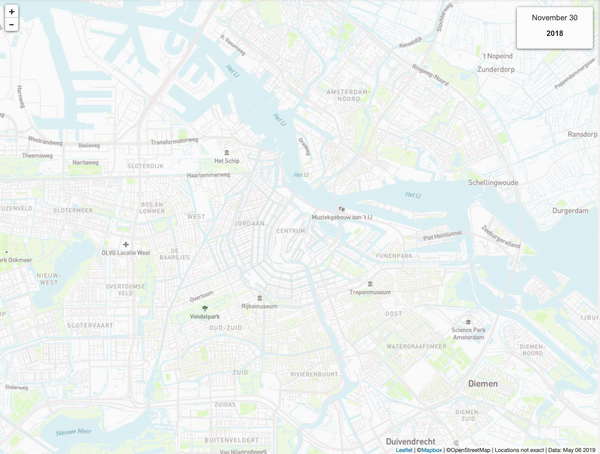
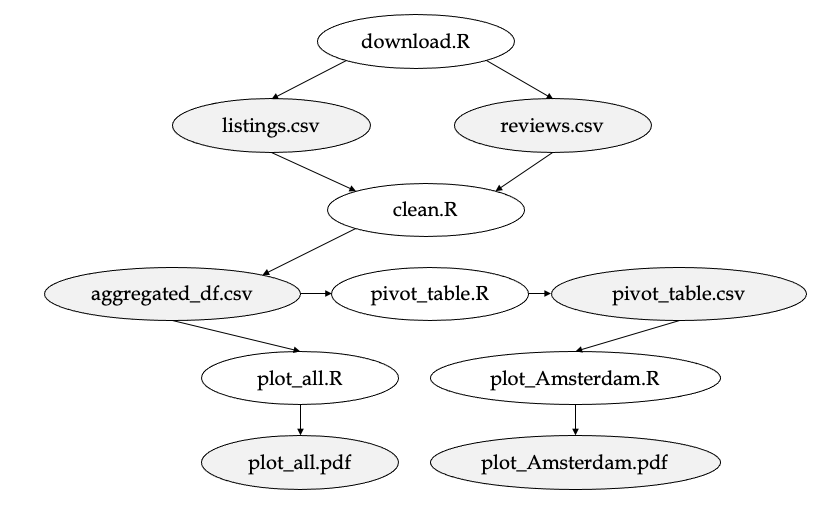

### Inside Airbnb
[Inside Airbnb](http://insideairbnb.com/index.html) is an independent open-source data tool developed by community activist Murray Cox who aims to shed light on how Airbnb is being used and affecting neighborhoods in large cities. The tool provides a visual overview of the amount. availability, and spread of rooms across a city, an approximation of the number of bookings and occupancy rate, and the number of listings per host. 

For example, [here](http://insideairbnb.com/amsterdam/) is the dashboard for the city of Amsterdam which shows us that 79% of the 19,619 listings are entire homes of which about a quarter is available all year round. Moreover, the animation below illustrates how the number of listings have been growing rapidly throughout the years:


\

### Research Question  
The overarching research question that we aim to investigate is:    
**How did the Airbnb market in Amsterdam respond to the COVID-19 pandemic in terms of bookings per neighborhood?**

To get to an answer, we need a multitude of input, transformation, and output steps. We'll use `make` to automate our workflows and make them reproducible. As data on Inside Airbnb is updated monthly, our program should still work once new data becomes available or if we change the city from Amsterdam to, for example, New York. 


---

### 1. Input

#### 1.1 Data  
The [data](http://insideairbnb.com/get-the-data.html) underlying Inside Airbnb have been analyzed, cleansed, and aggregated where appropriate to facilitate public discussion. In this data challenge, we focus on the `listings.csv` and `reviews.csv` files which contain the following information: 

*Listings*  
Information about the host, location, room type, price, reviews, and availability.

*Reviews*  
The listing ID and the date of the review. More details about the review such as the comment and author can be `reviews.csv.gz.` file but is outside the scope of this tutorial.

**Exercise 1**     
Before we fully automate our workflows, it is imperative to have a close look at the data. 

1. Set up a directory structure in accordance with these [guidelines](http://tilburgsciencehub.com/workflow/directories/). It should have a `data`, `gen`, and `src` directory and a `data-preparation` subdirectory in `src` and `gen`.
2. Manually download the most recent version of `listings.csv` and `reviews.csv` listed on [Inside Airbnb](http://insideairbnb.com/get-the-data.html) and store them in the `data` folder.
3. Create a data report (like you did in Data Challenge 1) .  
  * Read the data into R and generate an overview of the data (e.g., summary statistics, report on missingness, number of observations, etc.).
  * Explore interesting relationships in the data. 

```{r}
listings <- read.csv("../../data/listings.csv")
summary(listings)

reviews <- read.csv("../../data/reviews.csv")
summary(reviews)
```

\

**Solutions**  
An answer that includes the following elements: 

* The number of listings is (+/- 18K) is somewhat lower than the figure reported in the dashboard. 
* Most hosts have only one listing but some may account for 84 listings.
* Some listings received their last review in 2012 which indicates that not all listings may be in use anymore (for 2375 records this field is empty (`NA`) which suggests that they did not receive a review at all. This is confirmed by the number of reviews column (`0`)).
* Most listings receive less than a review per month (mean: 0.63, median: 0.30).
* The neighborhoods with the most listings are located in De Baarsjes - Oud-West, De Pijp - Rivierenbuurt, and Centrum-West. The `neighborhood_group` column does not contain any information and could therefore be removed.
* For half of the listings, the daily rate falls somewhere in between €94 and €180  (1st and 3rd quantile).
* The reviews file includes all historic reviews (not just the new ones since the last data release).
* Reviews are written between March 2009 and December 2020. 
* The total number of reviews (+/- 452K) are grouped by listing (16K). Given the total number of listings on Airbnb, it implies that not all listings have been reviewed (see comment above).

Note that the figures and years mentioned above are based on the dataset from December 2020 and thus may deviate from more recent versions of the dataset. 

\

**Exercise 2**   
Say that you want to share your work with others, you could essentially give them access to both the R file (`src` folder) and the two csv-files (`data` folder). Yet if you work with big data sets, you may run into problems: the data becomes too large to share through email, Github, or Google Drive. For that reason, it's recommended to create a script that pulls in the data directly from the source itself which is what you're going to do in this exercise.

1. Create a new file `download.R` and save it in the `src/data-preparation` folder.
2. Look up the URL of the download links of the most recent version of the `listings.csv` and `reviews.csv` datasets.
3. Download these two files from the aforementioned `urls` using the R code below and store them in the `data` folder.  `destfile` in `download.file()` refers to the (relative) filepath and filename (e.g., `../../data/listings.csv`).

```
download.file(url = url, destfile = filename) 
```
4. Run the R script from the command line and test whether it works as expected. First, type `R` in the command line (e.g., Terminal on Mac) and see whether it opens the R command line. If not, you may need to configure a path to the R library as described [here](https://stackoverflow.com/questions/44336345/running-r-from-mac-osx-terminal). Next, run the command below to run the download.R script from the terminal. It downloads the data from Inside Airbnb and stores it into the `data` directory.

```
R < download.R --save
```

{width=60%}

\

---

### 2. Transformation

As the author of Inside Airbnb notes, guests may leave a review after their stay, and these can be used as an indicator for the number of bookings. Although only verified guests can review listings, it is unlikely that every guest will take the time to write one. In reality, the number of bookings will thus exceed the number of reviews. 

\

**Exercise 3**  
Think of several arguments why this may or may not be a problem in the context of our research question.   

**Solution**  
Some hosts will be more likely to get reviews than others for a couple of reasons:

* Guest who had a highly positive (or negative) experience may be more inclined to leave a review to inform other Airbnb visitors.
* Guests may be more likely to leave a review for listings with many other reviews.
* The hosts have given a 5-star rating to the guests first and hope that they will reciprocate.
* The hosts might have specifically asked for it.

In other words, the likelihood of getting a review may not be uniform across all hosts. Yet it is another question whether this likelihood has significantly changed since the start of the pandemic. If not, then we can still use the number of reviews as a proxy for the number of bookings and examine the relative change compared to a pre-COVID period.

\

**Exercise 4**  
Create a file `clean.R` that loads the data from the `data` directory and reshapes the data into the following format: 

| date | neighbourhood | num_reviews |
| :---- | :---- | :---- |
| 2015-01-01 | Bijlmer-Centrum | 43 | 
| 2015-02-01 | Bijlmer-Centrum | 94 | 
| ... | ... | .... | 
| 2020-12-01 | Zuid | 23 |  


Please adhere to the step-by-step guidelines below:  

* Convert the date column of `reviews` into date/time format.
* Filter for `reviews` published since January 1st 2015
* Filter for `listings` that have received at least 1 review.
* Merge the `reviews` and `listings` dataframes on a common column.
* Group the number of reviews by date and neighborhood (aggregated on a monthly level). 
* Store the final data frames in `gen/data-preparation` as `aggregated_df.csv`

\

**Exercise 5**   
If we want to compare neighbourhoods side by side (e.g., Centrum-West vs De Pijp) in, for example, a plot we need to transform the data from a *long* format into a *wide* format. More specifically, we are after a data structure in which the horizontal column headers are the neighbourhoods and the rows the dates:


| date | Bijlmer-Centrum | Bijlmer-Oost | ... | Zuid | 
| :--- | :--- |:--- |:--- | :--- |
| 2015-01-01 | ... | ... | ... | ... |
| 2015-02-01 | ... | ... | ... | ... |
| ... | ... | ... | ... | ... |
| 2020-12-01 | ... | ... | ... | ... |

\

Import the data from `gen/data-preparatin/aggregated_df.csv`, reshape the data into wide format and store the result as `pivot_table.csv` in `gen/data-preparation`. 

\

---


### 3. Output

Finally, it's time to turn our generated files into plots which we can use for our analysis. First, we create the R scripts to create the plots. Second, we automate the entire pipeline using `make`. 

**Exercise 6**   
Create the following two deliverables (`plot_all.pdf`, `plot_Amsterdam.pdf`): 

\

**`plot_all.R`**  
A time-series plot that shows the total number of reviews over time (across all neighborhoods). Add a plot title and axes labels to make your graph easier to read. Store it as `plot_all.pdf` in `gen/plots` (don't forget to add a `plots` folder in `gen`!).

* Import the data from `gen/data-preparation/aggregated_df.csv`
* Convert the `date` column into date format.
* Group by date and calculate the sum of all reviews across neighourhoods.
* Plot the chart and store the visualisation.


\

**`plot_Amsterdam.R`**  
A time-series plot that shows the total number of reviews over time for the top 3 neighborhoods (Centrum-West, De Pijp - Rivierenbuurt, and De Baarsjes - Oud-West). Add a plot title, axes labels, and a legend to make your graph easier to read. Store it as `plot_Amsterdam.pdf` in `gen/plots`.

* Import the data from `gen/data-preparation/pivot_table.csv`
* Convert the `date` column into date format.
* Plot the chart and store the visualisation.

\

**Exercise 7**  
Up to this point, you should have created the following five R scripts: 

| File | Description | Phase | 
| ---- | ---------- | ------ | 
| `download.R` | Downloads the data from Inside Airbnb and stores as csv format | Input | 
| `clean.R` | Preprocesses the raw data into an aggregated format ready for analysis and visualisation  | Transformation | 
| `pivot_table.R` | Create a pivot table for the number of reviews by region across time | Transformation | 
| `plot_all.R` | Create a line chart for the total number of reviews in a city across time | Output | 
| `plot_Amsterdam.R` | Create a line chart for the number of reviews for the top 3 neighborhoods in Amsterdam | Output | 

\

As you've worked through the set of exercises, you've repeatedly built on preliminary results. For example, the plot for the top 3 cities in Amsterdam (`plot_Amsterdam.pdf`) could only be created once the `pivot_table.csv` file had been generated. In a similar way, the preprocessing pipeline (`clean.R`) could only take place once the data (`listings.csv` & `reviews.csv`) had been downloaded. These dependencies have been depicted in the figure below.

\

{width=55%}

\

Revisit the [study notes](http://tilburgsciencehub.com/workflow/automation/) on *"Automating your Pipeline"* and write a `makefile` that captures the end-to-end process (from `download.R` to `plot_all.pdf` & `plot_Amsterdam.pdf`). Also, add an `all` and `clean` phony target.

\

**Exercise 8**  
Swap the `url_listings` and `url_reviews` for a historical dataset of Amsterdam from the year 2016 (gather the links from the "[show archived page](http://insideairbnb.com/get-the-data.html)"). Run `make` again in the root directory. 
\

Do the same for a recent Airbnb dataset from New York.  If done correctly, it should not take more than a minute (power to automation!). Do your workflows still run as expected? How about the `plot_Amsterdam.R` file? Why is that?


\

**Exercise 9**  
Study the output files and formulate an answer to our initial research question as well as the following subquestions:

* Did all neighbourhoods in Amsterdam suffer equally from the pandemic? 
* Why is the number of listings in December 2020 remarkably low? 
* Discuss the methods you can use to test whether the identified relationship is statistically significant. How would you define the regression model? (no need to implement it here!)
* Comment on the limitations of our approach and come up with strategies to overcome them. 


<!--
\


### TEMPORARY NOTES

---


Every month the site updates these source files according to the changes on the Airbnb website (e.g., new listings and bookings). Although only the most recent data are listed (12 December 2020 here), archived data can be accessed as well (see figure below). Depending on the city, this data may go as far as back as the year 2015.


**Data**  

* Noemen dat je de data niet in Excel kan openen (capped at 1.04M rows)
* voor elke listing 365 calendar data points
  * Bijv. 12-12-2020 -> 13-12-2020 tot en met 14-12-2021;
  * kun je zelf ook proberen (je kunt niet verder terugscrollen in de kalender op Airbnb)
  * data-is-day-blocked attribute (web scraping ref)

Available
t = beschikbaar
f = niet beschikbaar

**Aantal reserveringen**

* Als de (kamer, datum) combinatie een keer "t" is geweest en in het vervolg "f" is dat beschouwen als een reservering -> (wordt te ingewikkeld!!!)
* Aannemen dat iedereen zijn calendar consequent bijhoudt en voor false kiest als ze ook niet willen verhuren -> blijkt geen goede aanname 
* Link to recent news articles
  * https://nos.nl/artikel/2328181-woning-via-airbnb-verhuren-in-den-haag-verboden-gemeente-gaat-beboeten.html
  * https://www.rtlnieuws.nl/nieuws/nederland/artikel/5184808/airbnb-rechtszaken-tuinhuis-belastingdienst

* max 30 dagen (bijv. als je zelf op vakantie gaat)
* woningen mogen niet structureel worden onttrokken


Follow-up questions: 


* Simple lagged timeseries model
  * Bookings = bookings 12 months ago + .. + price + room type dummy + COVID dummy
  * Export results with stargazer library (link to building block)
* Approximate estimated income / month
* Do hosts stick to the rental policy imposed by the city of Amsterdam (30 days / year max.)?


\

\


-->