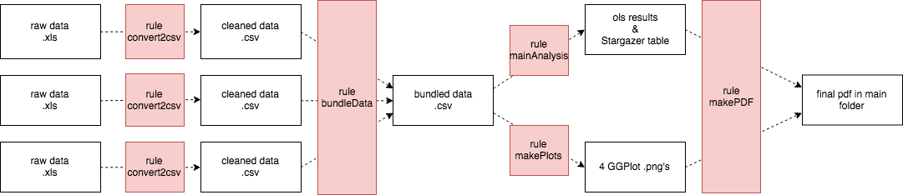
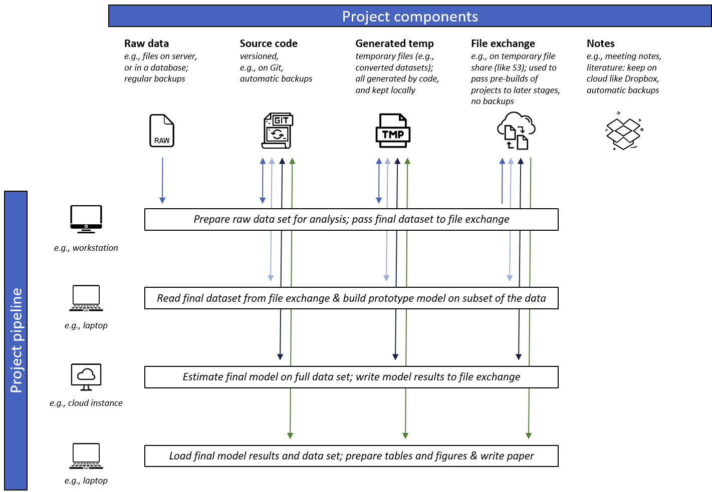
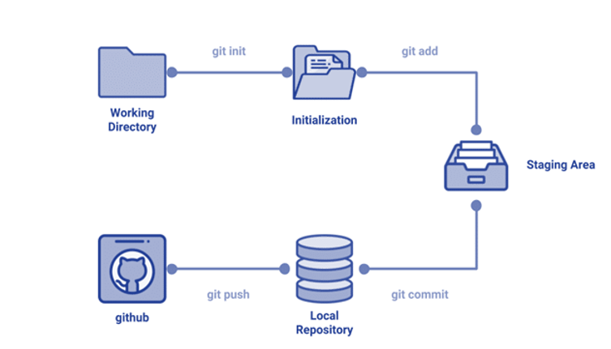

% Key building blocks of efficient workflows
% [Hannes Datta](https://hannesdatta.com)
% May 29, 2020

# Overview - Part 1

## Goals of this module

*Understand the [key building blocks of efficient workflows](http://tilburgsciencehub.com/workflow)*

- Think of your project as a pipeline
- Learn about the key components of a pipeline
- Discuss data management and directory structures
- Automate your pipeline

::: notes

could be a little dry

Gradual implementation possible

:::

# Pipelines

## Definition

*pipeline* {n.}: refers to the (usually automized) __steps necessary to build a project__; *workflow* used interchangeably

> - Examples: steps necessary to prepare data, run model, produce tables and figures

::: notes

- __What steps does your project consist of?__
- __Which steps did you already automize?__

- STAGES are the broader steps

:::

## Example: Academic paper

    - Stage 1: Prepare dataset for analysis
        - Step 1a: download raw data
        - Step 1b: clean data
        - Step 1c: aggregate data
    - Stage 2: Run model on a dataset
        - Step 2a: various variable configurations
        - Step 2b: select best fitting model
    - Stage 3: Produce tables and figures for the paper
        - Step 3a: load result of best-fitting model
        - Step 3b: produce output table

## Drafting a pipeline



. . .

- white boxes (inputs or outputs; concurrently!)
- red boxes (transformation by rules)

## Benefits of pipelines

- write clearer source code: smaller code chunks
- obtain results faster: automation (redo); change inputs & check outputs
- increase transparency and collaboration: work in different parts of pipeline
- software stack: full flexibility

## Discussion

__What are common pipeline stages in your domain?__

::: notes

as an academic, it's data-prep, model, writing

(What stages would you choose to change, remove, add?)

Think of:
    - what steps do I do, what steps do others do?
    - other deployment stages: e.g., dashboards, etc.

:::

# Components of a pipeline

## Definition

*pipeline components* {n}: refer to a project's building blocks, consisting of source code, data, generated files, and notes.

## (1) Source code

inputs [data, arguments] &#8594; transformation &#8594; output [datasets, log files, images]

. . .

- Examples:
    - load data from web, save locally as CSV
    - clustering: argument (set *k* for k-means); load matrix of tag words, cluster with *k*, save IDs & cluster IDs to csv
    - load results, compute fit statistics, output to .txt file
    - ...

::: notes

- responsible to **transform inputs into outputs**

:::

## (2) Raw data

- Data *stored remotely*
    - File-based systems (e.g., S3, FTP, Dropbox, Drive)
    - Databases (e.g., MongoDB, MySQL)
    - Get'em all: use our get-data tool!

- Those needed are downloaded *locally* (!)

- [Documented with `readme.txt`](http://tilburgsciencehub.com/workflow/documenting-data)!

::: notes

how do YOU store data?

:::

## (3) Generated files

- These are the *outputs* of your source code.
- Think about cleaned data sets, results of analysis, etc.
- If *final* --> "output"
- If *temporary* --> "temp"
- If used for auditing --> "audit"

::: notes

do you keep them separate? how?

:::


## (4) Notes

- Documentation, literature, PDFs, ...
- Keep in separate folder, with potentially subfolders

::: notes

where do YOU store them?

:::


## Conceptual framework

{ width=800px }

::: notes

- pipeline = logical steps in building project
- components = nuclear units

- why?
  - full portability across colleagues, computers
  - reproducibility and transparency (nothing manually edited)

:::

## Discussion

__What are the benefits (or drawbacks) of keeping project components separate?__

. . .

__Do you keep them separate, or not (and why)?__

::: notes

benefits: each has its own "data management" policies attached to it
e.g., code needs to be versioned, raw data does not


:::

# Data Management and Directory Structure

## Guiding principles

- Others should understand pipeline, merely by *looking at file/directory structure*
- Each step in pipeline is *self-contained* ("portability")
- Project is *versioned & backed-up* (more later)

## Let's share your practices

- How __do you__ keep files/directories tidy?
- How __do you__ ensure portability?
- How __do you__ version & back-up your project?

::: notes

-	Be prepared to show the directory of a recent project you’re working on – be able to explain that structure (you don’t need to revise the structure before class!)

Anybody wants to show?

:::

## How to store raw data

- Suggestions are [here](http://tilburgsciencehub.com/workflow/directories/)
    - CSV is more stable than XLSX, SAV, ...
    - Databases will shut down, so take copies of your data

- Transparent directory structure with [`readme.txt`](http://tilburgsciencehub.com/workflow/documenting-data) in each folder
  ```
  \data\website_A\...
  \data\company_B\...
  \data\data_provider_C\2019-11-04\...
  \data\data_provider_C\2020-03-01\...
  ```

## Project directory structure (1)

- Three main folders: `src`, `gen`, and `data`
- Subfolders represent pipeline stages (e.g., `data-prep`, `analysis`, `paper`)

```
\src\data-prep       <- SOURCE CODE
\src\analysis
\src\paper

\gen\data-prep\      <- GENERATED FILES
\gen\analysis\
\gen\paper\

\data\website_A\...  <- RAW DATA
\data\company_B\...
```

## Project directory structure (2)

- Keep generated files separate: `input`, `output`, `temp`, `audit` [notes](http://tilburgsciencehub.com/workflow/directories/#summary))

```
\src\data-prep       <- SOURCE CODE
\src\analysis
\src\paper
\gen\data-prep\input <- GENERATED FILES
\gen\data-prep\output
\gen\data-prep\temp
\gen\data-prep\audit
\gen\analysis\...
\gen\paper\...
\data\website_A\...  <- RAW DATA
\data\company_B\...
```
## Exploration

- Let's explore a directory structure in practice...
- E.g., view [structure of my Spotify paper](http://tilburgsciencehub.com/workflow/structure_spotify_2018.html)

__What's different from what I just told you?__

::: notes

1. Describe the directory structure – where did I store what?
2. What’s the use of the main directories in the project? (raw, derived, analysis) – why do I do it that way?
3. What’s that server directory doing?!

"project" centric - "wipeable"

"submodule centric" - self-contained, highly *portable*

:::

## Enabling portability (1)

- Output of one pipeline stage (e.g., `\gen\data-prep\output`) can be input to
another pipeline stage (e.g., `\gen\analysis\input`)

## Enabling portability (2)

- Potential solution *violating portability*
    - Code in `\src\analysis` reads directly from
`\gen\data-prep\output`
    - Fine if you work on your own

## Enabling portability (3)

- Better solution *ensuring portability*
    - Code in `\src\data-prep` moves `\gen\data-prep\output` to file exchange (e.g., S3, local server)
    - Code in `\src\analysis` downloads data from file exchange, puts it into `\gen\analysis\input`
    - Much better when working with others

## Using a directory template

Please download the [directory template](http://tilburgsciencehub.com/workflow/dir_structure.zip)

__What changes would you make to *use* this template for your own work?__


# Automation

## Automate your workflow

- Build tools introduce "recipes" of how to make stuff
    - *target* __what__ needs to be built (e.g., a file)
    - *source(s)* what is __required__ to execute the build?
    - *execution* how is the build to be __executed/run__?

## Use cases

- Build only what *needs* to be built
- Quickly move code to another computer (e.g., the cloud)
- "Loop" over different model specifications
- Nightly builds

::: notes

related to the practical example given earlier :::

## Example recipes

Let's generate some example recipes by writing __pseudo code__...

```
target: source(s)
    execution command
```

::: notes

more examples:
(a) tell me what will be built & the file names
(b) what are the dependencies
(c) how to run it, which software?

:::

## Make is *one* build tool

- Installed on Mac, Linux; [installable on Windows](http://tilburgsciencehub.com/setup/make)
- Documentation [here](http://tilburgsciencehub.com/workflow/automation/)
    - `make` runs entire workflow
    - `make -n` does a dry-run

::: notes


preview the TSH tutorial here

could also show another data set I have

:::

## Learning about *relative* paths

- You all know how *absolute* paths look like: `c:\projects\jads\data\myfile.csv`
- But... what are *relative* paths?
    - Have reference directory; typically where file is in
    - Exercise
      - Open terminal
      - Navigate directory with `cd` and `dir` (Win) or `ls` (Mac)

## What to automate?

- Automate everything that *can* be automated

::: notes

but... limits to automation!!!

may cost a lot of time

:::


## Activity

__Let's learn from some makefiles!__

- Check out some `makefiles`
    - [Researcher](https://kbroman.org/minimal_make#more-complicated-examples)
    - [Software devel](https://en.wikipedia.org/wiki/Make_(software)#Example_makefiles)

- Can you understand what's being done?
- How are they structured? Do you recognize any "sections"?
- What's the same, what's different from what you have seen in this tutorial so far?

::: notes

- parameters so that you can loop
- variables so you don't have to repeat commands
- use of cleaning rules

:::


# Overview - Part 2

## Goals of this module

*Understand the [key building blocks of efficient workflows](http://tilburgsciencehub.com/workflow)*

- Learn how to document your workflow and (raw) data
- Discover how versioning can change your life
- Collaborate on open source projects via GitHub
- Housekeeping that sparks joy!

# Documentation

## Documenting code and pipeline

- include one for main project ([template here](http://tilburgsciencehub.com/workflow/documenting-code/))
- include one for each stage of your pipeline
    - `makefile` is a good substitute for that documentation

## Documenting (raw) data

- Import for newly generated raw data *and* any generated output data
- You can make use of [this template](http://tilburgsciencehub.com/workflow/documenting-data/)

## Activity

- Think about a data set __you have generated__
    - Which sections of [the template](http://tilburgsciencehub.com/workflow/documenting-data) would you find easy to fill in, which ones hard?
    - Do you find all sections equally important?

. . .

- Think about a data set you are using (i.e., __somebody else made it__)
    - Which aspects in [the template](http://tilburgsciencehub.com/workflow/documenting-data) would you have liked to know (but don't, because nobody documented it)?

__Let's share your learnings!__

::: notes

- which sections are there?
- what would you write?


:::


# Versioning on GitHub

## Versioning the old way

- Use dates in file names, initials for authors

```
cleandata_022113.do
cleandata_022613.do
regressions.log
cleandata_022113a.do
cleandata_022613_jms.do
regressions_022413.do
regressions_022713_mg.do
regressions_022413.log
```

::: notes


- Good
    - Facilitates comparison
    - Facilitates undoing, rolling back
- Bad
    - Which log file comes from which regression?
    - Which version of `cleandata` was used to make data for `regressions`?
    - No software firm does it like that!

:::

## Versioning the new way

- Make use of software tools like Git(Hub)
    - Git is locally installed, open-source
    - GitHub is Git in the cloud; many other providers available

- Git saves *changes* rather than snapshots
- Git allows you to work *in parallel*, with others

::: notes

- show git in an example directory, and how it incrementally saves stuff
- show .gitignore

:::

## Git workcycle (1)



## Git workcycle (2)

- Several times a day
  - `git status`: What has changed?
  - `git add`: staging
  - `git commit -m "message"`: commit ("save") + note to your future self

- Sync at the end of the day
  - `git push`: push to server (e.g., GitHub)
  - `git pull`: get updates from server

- [More on TSH](http://tilburgsciencehub.com/workflow/versioning)
- [Wonderful cheatsheet](https://education.github.com/git-cheat-sheet-education.pdf)

# Collaboration and project management

## Collaboration on GitHub

- Find a project to collaborate on
- Fork repository
- Build the project
- Do your work!
  - Create branch for each feature
  - Perform Git workcycles
- Done? Create pull request
  - Owner of main repository will review, then integrate changes

## Project management on GitHub

- Issues
- Project board
- Milestones

# Implementation and Housekeeping

## Implementation

- Start gradually
    - e.g., have a directory structure first + move files; then start to automate __step by step__
- Use projects or templates you can learn from (e.g., on [Tilburg Science Hub](http://tilburgsciencehub.com))

## Tidying up

- Because we versioned, we can *delete what can be deleted*
- Testing for portability
    - locally: restart PC, rerun
    - locally: wipe `gen`, rerun
    - other computer: run `make`
    - other computer, different OS: run `make`
    - fix, fix, fix


::: notes

    On own computer
    Wipe all temp and output files
    Restart your PC
    Run makefile

    Does it reproduce the results?

    On other computer (I use a virtual PC in the cloud)
    Install software as instructed in readme
    Run makefile

    Does it reproduce the results?


:::

## Checklist

We've compiled a [housekeeping checklist here](http://tilburgsciencehub.com/workflow/checklist/)

## Drafting an implementation plan

__Which steps are important?__

__How would you proceed?__

## Implementation suggestions

1. Version stuff, but exclude file types that need not to be versioned!
2. *Draft* pipeline: which *stages* do you need?
3. Move files in proper directories ([use directory template](http://tilburgsciencehub.com/workflow/dir_structure.zip))
4. Build pipeline (input, outputs for each file) + test manually
5. Make `make` work on what you have

::: notes

can do it for one project if you like...


:::
