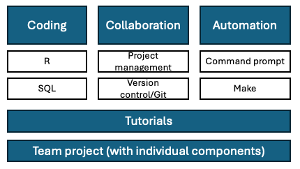
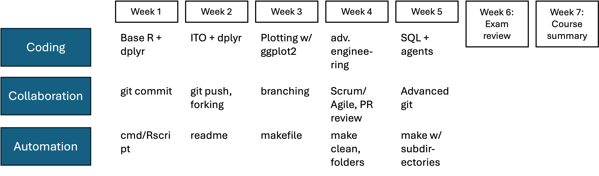

## Welcome to dPrep!

We are about to start the first lecture of this class.

If you haven't done so, please check out the **Canvas page** for this course:

- complete the *software installation* (see "preparation before this class on Canvas")
- explore the *course syllabus* on Canvas
- check the weekly modules and this week's checklist

<!--
- drafted this course for a very long time
- finally got the chance to teaching it now
- what is it about: radical change in the way to work on data-intensive projects
- anything you've learnt so far is about stats, or substantive areas, not about HOW to work on projects
- happy to share that vision, and share practical tips
-->

---

## Agenda

- Part 1 (12.45–13.45)
  - Meeting each other
  - Motivation for the course
  - Course framework and learning goals
  - Team project flow and practical arrangements
- Break
- Part 2 (14.00–16.30): R Bootcamp on your laptops or in the cloud

---

## Disclaimer

::: incremental
- Mix of lectures, teamwork and self-study — all are necessary
  - I do the lectures and course coordination
  - Javier Torralba Flores will help you master the tutorial sessions
  - Jeroen Swolfs will coach you on the team project
- About me
  - I record my lectures and post them on Canvas (remind me if I miss to post one--or forget to start the recording)
  - Consider me your coach, not your "distant professor"
  - Slow me down if needed
- You will have to invest a lot of time and energy

:::

---

## Research and teaching (all openly available)

- Research on digital media and branding: [hannesdatta.com](https://hannesdatta.com)
- Teaching: [thesis supervision](https://thesis.hannesdatta.com), [oDCM](https://odcm.hannesdatta.com)
- AI and open science: [tilburg.ai](https://tilburg.ai), [tilburgsciencehub.com](https://tilburgsciencehub.com)
- Socials: [Youtube](https://youtube.com/c/hannesdatta), [LinkedIn](https://linkedin.com/in/hannesdatta), [GitHub](https://github.com/hannesdatta)

---

## Getting to know you

::: incremental
- Ever wrangled with messy data? How did you clean it? Did you team up or go solo?
- What programming languages do you know--if at all? Who’s ever used R? SQL? Python?
- Imagine your dream job — what’s it going to be?
:::

--- 

## Motivation for course (I)

- Did my PhD in quantitative marketing
- Coded a lot (data prep, modeling), but did not *learn how to structure my work*
- Created a [complete chaos](https://rawcdn.githack.com/tilburgsciencehub/website/0e71e9b387ee125aaff8043892cee076d3019284/content/topics/Automation/Workflows/principles-of-project-setup-and-workflow-management/structure_phd_2013.html#D:/Datta/Dropbox/PhD/Revision) (but still [got published](https://doi.org/10.1509%2Fjmr.12.0160))

---

## Motivation for course (II)

- Could not find code that prepared the dataset
- Could not find code of the econometric model that eventually got published

&rarr; lack of __replicability__, __reproducibility__, and __efficiency__

---

## Why should you care?

- You will soon work on data-intensive projects — thesis, internship, business
- You will change code *continuously*
- Team members/colleagues need to read and reuse your code
- Learning "good practices" takes time, but  

&rarr; even small **efficiency** gains pay off quickly

---

## Efficient vs. Not Efficient

| **Efficient when…** | **Not efficient when…** |
|---------------------|-------------------------|
| - Prototype the “final pipeline” early, then refine | - Wait passively for results or data prep |
| - Returning to a project feels low-effort | - Forget how things were done (and why) |
| - Mistakes are caught quickly | - Get distracted while waiting |
| - Tasks can be rotated across teammates | - Work gets lost in undocumented code |
| - Code and results are reusable (e.g., via packages) | - Data and files go missing |
| - Feedback from others improves the workflow | - Endless “final_final.xlsx” versions appear |

---

## So what’s the solution?

You need a **tool stack**: the __practices__, __tools__, and __habits__ that keep projects organized, reproducible, and efficient.

- **People & Habits** – docs, naming conventions, code reviews
- **Plan & Track** – issues, milestones, project boards
- **Code & Environment** – R/Positron, Git, package management
- **Data Layer** – raw / temp / final folders, CSV + SQL
- **Build & Orchestrate** – `make`, automation, reproducible execution
- **Analysis & Modeling** – `fixest`, `lm`, ...  
- **Reporting & Apps** – Quarto, Shiny, Flask, Streamlit

---

## Choosing the Right Tool Stack

- **Small / Short-term projects**  
  - Solo work, low complexity  
  - Tools: clear folder structure, Positron, Git, README  
  - Setup: local (laptop only)  

- **Medium / Thesis-scale projects**  
  - multi-person, weeks, multiple data sources  
  - Tools: GitHub (issues/boards), `make`, Quarto
  - Setup: mostly local, with optional cloud storage/sharing  

- **Large / Team projects**  
  - Multi-person, multi-months, large datasets  
  - Tools: all of the above + Docker, CI/CD, databases
  - Setup: hybrid — local development + cloud for compute & data  

&rarr; **Rule of thumb**: Start simple → add tools (and cloud) when projects grow.

---

## Course objectives

- Use GitHub (or similar tools) to manage empirical projects with Scrum-inspired practices
- Use Git/GitHub (or similar tools) for versioning and collaboration
- Use R/Positron and SQL to clean and transform data for analysis
- Use R/Positron to generate automated reports and dashboards
- Use workflow tools to create portable and reproducible pipelines
- Critically assess when and how to use LLMs/software agents responsibly

---

## Course framework

---

## Tutorials: Content

All weeks combine self-study, hands-on coding, and team collaboration.

---

## Team project

- You are not writing a traditional research paper
- You are building project **infrastructure** around one:
  - clean workflow
  - transparent versioning
  - reproducible automation
  - strong collaboration habits
- Team data: realistic (simulated) TikTok watch-log data
  - starts in CSV
  - later includes SQL database input

Deliverable quality is assessed from your GitHub repository state at each deadline.

---

## Team project workflow (week by week)

- **Week 2 (team):** fork template repo, set up `README.md`, complete issues, create Quarto CSV summary, commit frequently
- **Week 3 (individual):** work on assigned issue, build visualizations, use feature branch + pull request, add `Makefile`
- **Week 4 (individual + team):** review peers, improve code (loops/regex/interpolation), integrate PRs into stable `main`
- **Week 5 (team):** add regression, modularize folders, switch to SQL input, complete end-to-end `Makefile`
- **Week 6 (optional coaching):** final feedback and reproducibility checks before submission

Deadlines for Weeks 2-4 are each due the day before the next coaching session.

---

## Project grading logic

- Team work = **65%** of project grade
  - Week 2: 25%
  - Week 4 team integration: 15%
  - Week 5: 25%
- Individual work = **35%** of project grade
  - Week 3: 25%
  - Week 4 individual contribution: 10%
- No self- or peer-assessment grade adjustment

---

## AI policy in the project

- **Weeks 2-3: Level 3** (AI-assisted idea generation and structuring)
- **Weeks 4-6: Level 4** (AI task completion, human evaluation)
- You may generate code with AI tools, but you remain responsible for correctness and quality
- Keep a concise AI-use logbook (tool used, task, what you accepted/rejected)
- Undeclared or non-compliant AI use can be treated as fraud

---

## Assessment

- Computer exam (60%, 120 minutes) → on campus, no internet  
  - Mix of open + closed questions  
  - Covers tutorials and core course materials
- Team project with individual contributions (40%) → based on repository deliverables and rubric

To pass the course:

- final weighted grade must be at least 5.5
- exam grade must be at least 5.0

---

## Teaching team responsibilities

- **Hannes Datta**: lectures, course coordination, exam preparation
- **Javier Torralba Flores**: tutorials and technical support during class
- **Jeroen Swolfs**: team coaching and project guidance

We all support you in troubleshooting and making steady progress

## Tips & tricks

- Familiarize yourself with this course (e.g., syllabus) on Canvas
- Early weeks are toughest, but skills build quickly
- Stick with the same group and mix skill levels
- Collaborate and help each other
- Coding can be frustrating and tiring (take breaks, ask for help, use AI critically)
- Keep feedback loops short in the first weeks

&rarr; Use Canvas announcements and coaching sessions for fastest support.

---

## Getting in touch with us

- __Javier Torralba Flores__ (tutorials) - via email
- __Jeroen Swolfs__ (coaching, project questions) - via email
- __Hannes Datta__ (course coordination, lectures, book + all remaining questions) - WhatsApp (+31134668938; email)
  
{width=50% height=50%}

## Next steps

- Find a group by week 2 (4–5 students, mix skills!)  
- Complete software installation
- Please read chapters 1-2 of "Marketing Analytics: A Modern Toolkit"
- Most up-to-date info: Canvas &rarr; (weekly) modules

  

After a well-deserved break → **R bootcamp**.
