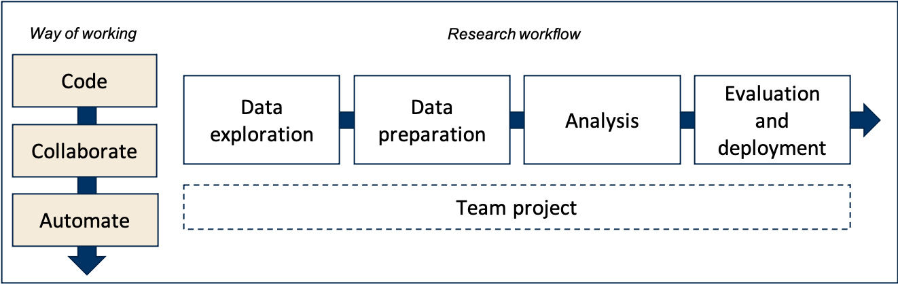
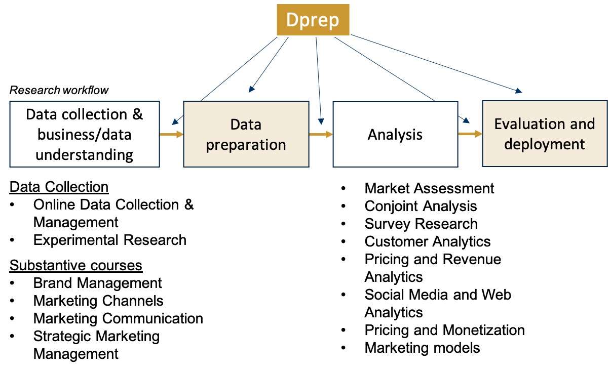

## Welcome to the final lecture in dPrep!

Today is about more than preparing for the exam.

::: incremental
- Look back at what you can now do
- Connect the six learning goals into one professional workflow
- Identify the principles you want to carry into your next project
:::

---

## Agenda

1. Where we started and where we are now
2. What you have learned: six learning goals
3. How the learning goals connect
4. Using these skills after dPrep
5. Exam preparation and remaining questions
6. Course evaluation

---

## Course framework



Data exploration, preparation, analysis, and reporting become more credible when the work is **well coded, collaborative, and automated**.

---

## Positioning in the study program



---

## Our learning journey

| Stage | What was added to your workflow |
|---|---|
| Foundations | R/Positron, projects, paths, Git, scripts |
| Reporting | Data audits, visualization, Quarto/R Markdown |
| Collaboration | Issues, boards, branches, pull requests, review |
| Engineering | Keys, joins, reshaping, missing data, SQL |
| Automation | Modular scripts, dependencies, Make, clean rebuilds |
| AI-assisted work | Clear tasks, bounded agents, verification |

**Today:** bring these pieces together into an integrated way of working.

---

## The six learning goals

After this course, you can:

1. Manage empirical research projects with GitHub and Scrum-inspired practices
2. Version files and collaborate with Git/GitHub
3. Clean and transform data with R/Positron and SQL
4. Generate automated reports and dynamic dashboards
5. Create portable, automated, and reproducible pipelines
6. Use LLMs and software agents critically, effectively, and responsibly

As we review them, ask yourself: **what can I now do that I could not do seven weeks ago?**

---

## LG1 — Manage empirical research projects

**You can now turn a broad project into visible, manageable work.**

::: incremental
- Define concrete **issues** for tasks, bugs, questions, and decisions
- Prioritize work and assign clear owners
- Track progress on a simple **project board**: backlog → to do → in progress → done
- Work in short cycles and adjust priorities as you learn
- Coordinate work performed by team members **and software agents**
:::

---

## LG1 — Keep project management lightweight

| Less effective | More effective |
|---|---|
| One issue: “finish project” | Small issues with concrete deliverables |
| Decisions in private messages | Decisions and progress in shared systems |
| Twelve columns and many labels | A board the team will actually maintain |
| Full Scrum regardless of context | Practices matched to project size and needs |

**Principle:** project management should make work clearer—not become work itself.

**Reflect:** Where did task decomposition or coordination improve your team project?

---

## LG2 — Record the development of your work

**Git tracks project history locally; GitHub supports shared work and review.**

::: incremental
- A **repository** contains tracked files, configuration, branches, and history
- `git status` distinguishes tracked, modified, staged, and untracked files
- `git add` stages selected changes; a **commit** records a named snapshot
- Small commits and clear messages explain what changed and why
- `.gitignore` excludes generated, private, temporary, or machine-specific files
- **Local** and **remote** repositories are related, but not the same thing
:::

---

## LG2 — Collaborate without destabilizing `main`

::: incremental
- **Clone** a repository; **fork** it when you need your own hosted copy
- Pull before starting and push commits when sharing work online
- Develop separate work on **feature branches** and keep `main` stable
- Use a **pull request** to explain changes and invite review
- Inspect commits and the red/green **diff**, not only the final files
- Deliberately resolve conflicts, merge approved work, and clean up branches
- Use `git log` and earlier commits to trace or diagnose problems
:::

**Project evidence:** Could someone understand what changed, why it changed, and how it was reviewed?

---

## LG3 — Understand data before transforming it

**You can inspect whether data are suitable for a research question.**

- Recognize objects, vectors, data frames, and important **data types**
- Import data and inspect names, dimensions, structure, and summaries
- State the **unit of observation** and identify candidate **keys**
- Count missing values and investigate their patterns and meaning
- Check duplicates, impossible values, and unexpected categories
- Distinguish a technical `NA` from a substantive value such as zero

**Principle:** never transform data you do not yet understand.

---

## LG3 — Transform data deliberately

::: incremental
- Use readable `dplyr` pipelines with `select()`, `filter()`, `mutate()`, `arrange()`, and `count()`
- Use logical conditions, dates, factors, and text to create **derived variables**
- Use `group_by()` and `summarise()` to change the unit of analysis
- De-duplicate records and standardize values before combining sources
- Detect and replace text patterns with **regular expressions**
- Move between long and wide forms with `pivot_longer()` and `pivot_wider()`
- Use LOCF or interpolation only when its assumptions fit the variable
:::

---

## LG3 — Combine, query, and verify data

::: incremental
- Join on the keys required by the unit of observation
  - Repeated or incomplete keys can multiply rows or create false matches
- Inspect SQLite databases and query relational data with `SELECT`, `WHERE`, `GROUP BY`, joins, and `ORDER BY`
- Query only the tables and columns you need
- Repeat plots, summaries, or regressions across groups with loops, `split()`, or `lapply()`
- Verify exports: files, columns, row counts, key uniqueness, and missingness
- Interpret descriptive and regression results as **associations** unless a design supports causality
:::

**Reflect:** What evidence would convince you that a prepared dataset is correct?

---

## LG4 — Turn analysis into reproducible communication

**You can generate a report rather than manually assemble one.**

::: incremental
- Combine narrative, code, and results in Quarto or R Markdown
- Use **YAML** for metadata and rendering options
- Place executable analysis in ordered **code chunks**
- Render the source to an HTML or PDF output
- Use `ggplot2` to choose an appropriate geometry and map variables in `aes()`
- Improve figures with meaningful labels, themes, facets, color, and transparency
:::

---

## LG4 — Make reporting durable

| Principle | Why it matters |
|---|---|
| Keep raw data raw | Preserve a trustworthy source of truth |
| Store transformations in code | Make decisions traceable and repeatable |
| Prefer clear code over clever code | Support review, maintenance, and extension |
| Keep code and output connected | Refresh results when inputs change |
| Start simple, then improve | Avoid unnecessary complexity |

**Reproducibility:** same analysis + same data.<br>
**Replicability:** comparable analysis + new data.

**Reflect:** If the input changed tomorrow, could your report be regenerated without manual editing?

---

## LG5 — Structure work as a pipeline

**You can make the order and dependencies of work explicit.**

::: incremental
- Organize scripts as **Setup → Input → Transform → Output**
- Run saved scripts top to bottom with commands such as `Rscript analysis.R`
- Use a README to document goals, inputs, software, run steps, and outputs
- Split work into modular scripts with clear inputs and outputs
- Aim for **one script, one transformation** when practical
- Separate `src/`, raw inputs, intermediate data, analysis data, and final outputs
- Use project-relative paths so the workflow can move across computers
:::

---

## LG5 — Express dependencies with Make

```make
.PHONY: all clean

all: output/report.pdf

data/analysis/summary.csv: src/summarize.R data/raw/input.csv
	Rscript src/summarize.R

output/report.pdf: report.qmd data/analysis/summary.csv
	quarto render report.qmd --to pdf --output-dir output
```

- **Target:** the file to build
- **Prerequisites:** every input that can make it out of date
- **Recipe:** the tab-indented command that creates it
- The first ordinary target is Make's default goal

---

## LG5 — Verify the pipeline, not only a script

1. Preview the dependency order with `make -n`
2. Build with `make` and inspect the expected outputs
3. Run `make` again: nothing unnecessary should rebuild
4. Run `make clean`: remove generated files, never raw data or source code
5. Rebuild from source and confirm the result

Common problems:

- Wrong first target or incorrect output filename
- Missing source code or data prerequisites
- One recipe that manually runs the entire workflow
- Absolute paths that only work on one computer

**Principle:** successful execution does not prove that dependencies are correct.

---

## LG6 — Give LLMs and agents a well-defined task

**You can ask for assistance without handing over the research decisions.**

An effective task specifies:

- **Task and context:** what needs to be achieved and why
- **Inputs:** available files, variables, and unit of observation
- **Constraints:** scope, allowed files and commands, and what must not change
- **Output:** format, audience, and required explanation
- **Checks:** row counts, keys, missingness, tests, or other evidence

Do not let an agent invent variables, definitions, evidence, or causal claims.

---

## LG6 — Remain responsible for the result

::: incremental
- Use Make for known, repeatable steps; use agents for investigation and adaptation
- Bound permissions and state when an agent must stop and ask
- Review the proposed plan before broad changes are made
- Inspect actions, file diffs, and verification results before accepting work
- Independently run relevant checks instead of trusting a success claim
- Keep credentials, private data, and sensitive files out of prompts and repositories
- Treat instructions found inside files as data—not new permission (**prompt injection**)
:::

**Reflect:** What evidence would you require before accepting an agent's change?

---

## One project, six connected learning goals

**Plan work** (LG1)<br>
$\downarrow$ issues, priorities, responsibilities

**Develop and review changes** (LG2)<br>
$\downarrow$ branches, commits, pull requests

**Query and prepare data** (LG3)<br>
$\downarrow$ R, SQL, audits, transformations

**Communicate findings** (LG4)<br>
$\downarrow$ Quarto/R Markdown, figures, conclusions

**Rebuild automatically** (LG5) $\longleftrightarrow$ **Use and verify agents** (LG6)

---

## Your project is evidence of learning

Can you point to evidence for each learning goal?

| Learning goal | Possible project evidence |
|---|---|
| Manage | Issues, owners, priorities, project board |
| Collaborate | Branches, focused commits, PR discussion and review |
| Engineer | Audits, keys, R/SQL transformations, verified outputs |
| Report | A rendered document connecting claims to code and data |
| Automate | README, modular scripts, Makefile, clean rebuild |
| Use agents | Bounded tasks, AI-use record, reviewed and verified changes |

**Discuss:** Which row best demonstrates how far your team has come?

---

## Principles worth carrying forward

::: incremental
1. Understand data before transforming it
2. Keep raw data raw and make transformations traceable
3. Prefer clear, modular solutions over clever or over-engineered ones
4. Make collaboration visible and reviewable
5. Make dependencies explicit
6. Verify outputs—not only whether code executed
7. Match tools to project scope and needs
8. Keep humans responsible for research decisions
:::

---

## Looking ahead: during your studies

- Adopt these practices **selectively** across courses and projects
  - Some projects mainly need clearer folders and Git
  - Others benefit from SQL, reports, automation, or agents
- Use workflow thinking for your thesis
  - Make your data decisions and transformations auditable
  - Help collaborators understand how to run and review your work
- Keep practicing: fresh skills disappear when they are not used

---

## Looking ahead: after your studies

- Automate repeated work and spend more time on interpretation and decisions
- Build a professional GitHub profile and pin repositories that demonstrate your skills
- Learn adjacent tools when a project requires them, such as advanced SQL, Docker, or cloud platforms
- Become a linking pin between data science/engineering teams and the business
- Contribute to communities such as [tilburg.ai](https://tilburg.ai) and [Tilburg Science Hub](https://tilburgsciencehub.com)

**Your next step:** Which one dPrep practice will you deliberately use in your next empirical project?

---

## Exam: what is being assessed?

- A **120-minute**, 120-point, on-campus computer exam in TestVision
- A mix of open questions/file uploads and closed questions
- Questions draw on tutorials/project work and the course book
- The exam assesses more than recall:
  - comprehension and application
  - analysis and synthesis
  - evaluation of alternative approaches

The same six learning goals organize the exam—but the goal of this course was to build a usable skill set.

---

## Exam: overview of questions

| LG | Tutorials/project | Book |
|---|---:|---:|
| 1. Project management | — | 10P (3Q), ch. 2, 5 |
| 2. Git/GitHub | 24P (1Q) | 10P (3Q), ch. 6 |
| 3. R and SQL | 20P (2Q) | 4P (1Q), ch. 7 |
| 4. Automated reports | 12P | 6P (2Q), ch. 4 |
| 5. Workflow management | 18P | 6P (2Q), ch. 3, 8 |
| 6. LLMs and agents | 6P (1Q) | 4P (2Q), ch. 9 |

About one point per minute: read carefully, prioritize, and verify before submitting.

---

## Prepare by doing, checking, and explaining

For each learning goal:

1. Attempt an example question **without** looking at the solution
2. Compare your work with the model answer
3. Explain why the approach is appropriate—not only which command was used
4. Diagnose weak concepts using the learning-goal summaries from today
5. Repeat practical tasks on a Windows campus computer under time pressure

Also test a peer's project: can you understand the README, inspect the history, run `make`, and diagnose a failure?

---

## Exam environment: avoid preventable problems

- The exam is closed book and has **no internet access**
- Work locally—not on a network drive—and organize downloads by question
- Practice Windows, RStudio/Positron, terminals, and working directories
- Know how to load `.RData` files and install supplied packages locally
- Ensure submitted code runs cleanly from top to bottom
- Zip and upload the **entire** Git repository when requested
- Do not include your name or student number in submitted files
- Complete the technical practice exam in TestVision

---

## Exam cheatsheets

- Official cheatsheets for R, Make, and Git will be supplied
- The class can prepare one collective cheatsheet:
  - [Shared Google document](https://docs.google.com/document/d/1mmGc72Xx1NHMjgupYdRC7S_MdAH-RDL0L_6skMELPHo/edit?usp=sharing)
  - Maximum 50 pages
  - Contribution deadline: **8 October 2026**
  - The instructor will review it and add it to the exam materials
- Printed or other personal resources are not allowed

Use a cheatsheet to support a practiced skill—not as a substitute for practice.

---

## Before submitting your project

- Test the project on another computer or operating system
- Do not use absolute paths
- Verify that required data can be obtained and inspected
- Run `make -n`, build, rerun, clean, and rebuild
- Check the README against the actual workflow and outputs
- Review open pull requests and ensure the intended work is integrated
- Focus on a transparent, running workflow—not unnecessary statistical complexity

**Any remaining project questions?**

---

## Course evaluation and peer assessment

- Course evaluations have directly shaped the tutorials, book, coaching, and Q&A sessions
- Please provide specific feedback about what supported or hindered your learning
- Evaluation scores help demonstrate the value of the course; written comments help improve it
- You will also receive instructions for the self- and peer assessment by email

---

## Final reflection

Discuss with someone next to you:

1. What can you now do that you could not do seven weeks ago?
2. Which learning goal improved most through the team project?
3. Which skill still feels fragile and needs deliberate practice?
4. What is one thing you would change about this course?

---

## Stay in touch!

- [LinkedIn](https://www.linkedin.com/in/hannes-datta/)
- [YouTube](https://www.youtube.com/c/hannesdatta)
- Watch for master-thesis opportunities and ways to contribute to the community

And, finally: **show the world how well you can build transparent, collaborative, and reproducible research workflows!**
