```{r setup, include=FALSE}
knitr::opts_chunk$set(echo = TRUE)
if (!requireNamespace("webexercises")) {
  stop("You must have the 'webexercises' package installed to knit to HTML.\n   install.packages(\"webexercises\")")
} else {
  library(webexercises)
}

show_solutions=TRUE

hide <- function (button_text = "Solution", visible=show_solutions) 
{
  if (visible==T) {  
  rmd <- !is.null(getOption("knitr.in.progress"))
    if (rmd) {
        paste0("\n<div class='webex-solution'><button>", button_text, 
            "</button>\n")
    }
    else {
        paste0("\n::: {.callout-note collapse='true'}\n## ", 
            button_text, "\n\n")
    }
}
}

unhide <- function (visible=show_solutions) 
{
    if (visible==T) {
    rmd <- !is.null(getOption("knitr.in.progress"))
    if (rmd) {
        "\n</div>\n"
    }
    else {
        "\n:::\n\n"
    }
    }
}

```

```{css, echo=FALSE}
.badCode {
background-color: white;
}
```


# Getting Started

You may have used Google Drive or Dropbox to work together. That works for Word files.
For code, it often breaks:

* you overwrite each other’s changes
* you lose older versions
* you don’t know who changed what

In this tutorial you learn Git and GitHub. They help you work together on code, without losing work.

## Learning goals

After this tutorial you can:

* install Git and connect it to GitHub
* save versions of your files (with commits)
* go back to an older version if needed
* work together with team members using GitHub

# Part 1: What is version control?
  
## A Comparison between Google Docs and Git
  
Every time you make a change in a Google Docs file, the system keeps track of it, and you can always return to an earlier version of your work. Git provides similar functionality, but is specifically built for code. It is therefore a popular version control system among data analysts and data scientists. Git helps you understand what changes you made in the past, and why you did a specific analysis, even weeks or months later. In other words, it helps make your analysis *reproducible*, which is good scientific practice.

\

Git’s most important features are:
  
  * Nothing that is saved to Git is ever lost. You can always go back and see which results were generated by which version of your code. This means you never have to worry about **overwriting** or **losing your work**. We know the struggle: `assignment.docx`, `assignment-final.docx`, `assignment-final-FINAL.docx`…

* Workflows can be separated into so-called branches. Branches allow you to have **multiple versions** of your work and to work on several things at once.

* Git is highly useful in a **team environment** because everyone can work independently on the same files. Since there is a permanent record of who made each change, you can easily trace each other’s contributions.

* Git automatically notifies you when your work **conflicts** with someone else’s. For example, if you write `In this assignment, we explore...` while a teammate writes `The goal of this assignment is to...` at the same time, Git will report a merge conflict when you try to combine the changes. It then shows both versions side by side, so you don’t accidentally overwrite each other’s work.

\

## The Difference between Git and GitHub

One of the learning goals is *“Set up Git and GitHub”*. You may therefore wonder what the difference is between them, as both include the word “Git”.

### Git

*Git* is a version control system that runs on your local machine. It is typically used from the command line (Terminal on Mac, Git Bash on Windows). Git tracks your files and the changes made to them in a *repository* (or *repo*), which contains both the project files and their full history.

Below is an example of what working with Git can look like: the terminal shows that several files were modified and that a new folder (`images/`) has not yet been tracked. Don’t worry if this is not fully clear yet; we will explain these commands later.

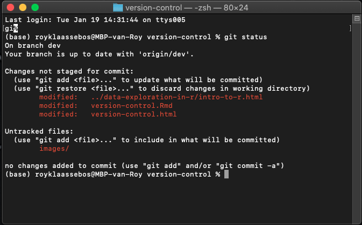{width=50%}

\

### GitHub

*GitHub* is a website that allows you to upload and store Git repositories online. It provides a backup of your files, a visual interface for browsing repositories, and tools that make collaboration easier. Others can view your work, contribute to it, or work on the same project with you.

Below is a screenshot of the GitHub repository where this file (`version-control.Rmd`) is hosted. It shows a folder structure similar to the file explorer on your computer. Repositories on GitHub can be public or private, just like folders in Google Drive.

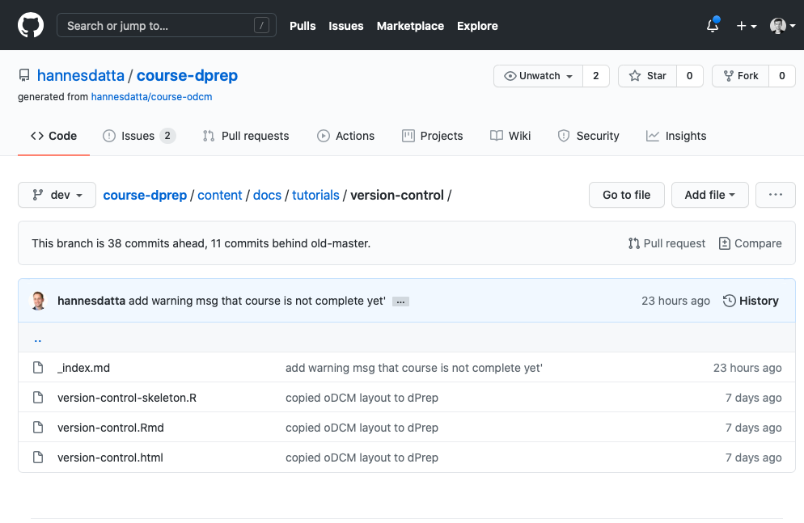{width=50%}
\

In summary:
  
* Git is the version control system that tracks changes to files over time.
* GitHub is a hosting service for projects that use Git.

## Exercise 1: Exploring a Repository

If you haven't done so, please create a [GitHub account](https://github.com/join?ref_cta=Sign+up&ref_loc=header+logged+out&ref_page=%2F&source=header-home) (we recommend using your university email!), log in, and navigate towards the [course repository](https://github.com/hannesdatta/course-dprep). Browse through the files and get a feeling for all the tabs and buttons (no worries: you can't break anything :-). Try to get an answer for each of the questions:

1. Who is the creator of the repository? What happens once you click on his username? 
2. When was the repository last updated? 
3. What do the brief text messages next to the files and folder relate to? 
4. Where can you find the `tutorials` folder? 
5. What happens if you "star" a repository? And what does that actually mean?
6. What happens once you switch to another branch? (e.g., `dev`)
7. Can you find a way to see how the first version (also known as "first commit") of the repository looked like? 
 
```{r, webex.hide = 'Solutions',include=show_solutions}
# 1. Hannes Datta - You go to his personal page!
# 2. The most recent update can be seen underneath "Go to file".
# 3. These are the commit messages for the most recent change made in that folder or file.
# 4. Material --> tutorials
# 5. Starring a repository makes it viewable on your stars page, which makes it easier to find a repository again at a later time.
# 6. You see the overview of the repository for that branch and the changes relative to the main branch.
# 7. One way is to click on the total number of commits and browse all the way to the first commit. A more convenient alternative could be to go to insights --> network. Here, you can see an overview of all changes made to the repository, what was done and by who.
```

## Exercise 2: Create a New Repository
  
In this exercise, you create a GitHub repository and copy it to your computer. We will use the **command line** so you understand what Git is doing.

### Step 1: Create a repository on GitHub

1. Go to [https://github.com](https://github.com).
2. Click the **“+”** in the top-right corner and choose **New repository**.
3. Name it `version-control-exercises`.
4. Keep it **public**.
5. Check **Add a README file**.
6. Click **Create repository**.

<center>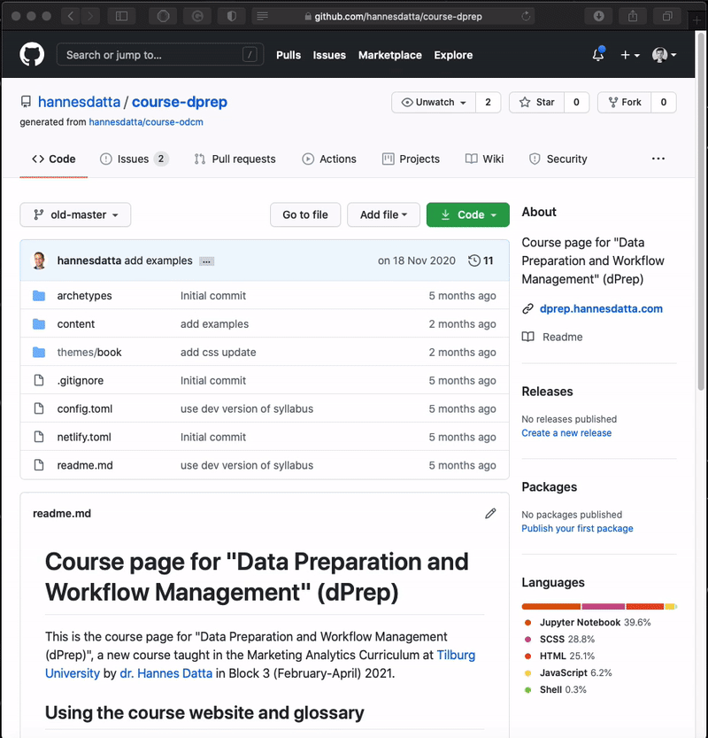{width=50%}</center>
  \

### Step 2: Edit the README on GitHub

The `README.md` file is shown on the main page of your repository.

1. Click the **pencil icon** to edit the README.
2. Add a few lines of text (any text is fine).
3. Scroll down to **Commit changes**.
4. Enter a short commit message (e.g. `update README`).
5. Click **Commit changes**.

<center>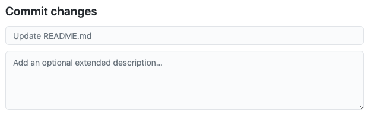{width=50%}</center>
  \

### Step 3: Copy the repository to your computer

Now we copy the repository from GitHub to your local machine.

1. Open **Terminal** (Mac) or **Git Bash** (Windows).
2. Move to the folder where you keep your course files.
3. On GitHub, click **Code** and copy the **HTTPS** URL.
4. Run: `git clone <URL>`
5. Press Enter. The folder `version-control-exercises` is now on your computer.

<center>{width=60%}</center>
  \

### Step 4: Check

Open the folder `version-control-exercises` on your computer.

* Does `README.md` exist? Does it contain the text you added on GitHub? If yes, you’re done.

\

**Note**: In this exercise, you created the repository on GitHub first and then copied it to your computer. If you already have a project folder and want to start using Git in it, you can run `git init` inside that folder to create a new Git repository.

# Part 2: The end-to-end Git workflow

## Overview of the Git workflow

Over time, working with Git will become as normal as pressing CTRL + S to save your work. Git helps you keep track of changes as you work. You repeat the same basic workflow many times a day. This section explains that workflow.

### Checking the status of your files (`git status`)

Git does not track files automatically. You have to tell it which files to track.  
The command `git status` shows:

- files that are not yet tracked by Git  
- files that were changed since the last commit  

This is usually the first command you run.

### Selecting files to save (`git add`)

\

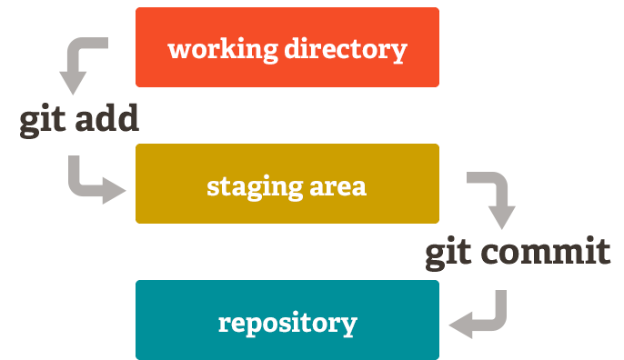{width=40%}

\

After checking `git status`, you choose which changes you want to save next.

You do this by adding files to the *staging area*. The staging area is a temporary place where you collect changes for the next commit.

- To add a single file: `git add <filename>`
- To add all changed files at once: `git add .`

You usually do **not** want to commit everything at once. For example, if you add a new feature in `data_preparation.R`, and fix a small bug in `data_analysis.R`, these changes should be saved in **separate commits**. In other words, commits should be *atomic*: each commit should do one clear thing. This makes it easier to understand changes and fix problems later.

### Saving changes (`git commit`)

Once files are staged, you save them using a commit: `git commit -m "<commit message>"`

A commit is a snapshot of your work at that moment. The commit message explains **what** you changed and **why**.

For example: `git commit -m "increase sample size to 1000"`. 

- Good commit messages make it easy for others—and your future self—to understand the project history without reading all the code.
- If you run `git commit` without `-m`, Git opens a text editor where you must enter the commit message manually. This works, but using `-m` is usually faster and easier.

\

**Short recap questions:**

- What command do we use to move files to the staging area? `r mcq(c(answer = "git add", "git commit", "git status"))`
- What command is used to see which files are not yet tracked `r mcq(c("git add", "git commit", answer = "git status"))`
- What command is used to save your changes? `r mcq(c("git add", answer = "git commit","git status"))`

## Exercise 3: Git Workflow

### Step 1: Go to your repository

Open a terminal (Mac) or Git Bash (Windows).  
Navigate to the folder `version-control-exercises`.

Use commands like:

- `cd <folder>`
- `cd ..`
- `ls` (Mac/Linux) or `dir` (Windows)

Once you are in the correct folder, run `git status`. You should see a message saying there is nothing to commit.

### Step 2: Create a new file

Create a new text file called `my_answers.txt` using Notepad (Windows) or TextEdit (Mac).  
Save the file inside `version-control-exercises`. Run `git status`. What does Git report now?

### Step 3: Add and commit the file

Add the file to the staging area and commit it.

Example:

```
git add my_answers.txt
git commit -m "add answers file"
```

### Step 4: Check GitHub

Open your `version-control-exercises` repository on GitHub.

- Is `my_answers.txt` visible?
- Why does it appear there now?

## Ignoring files with `.gitignore`
 
Data analysis often produces temporary or intermediate files that you don't want to save (e.g., `.DS_Store` or `.Rhistory`). Also, especially when working in a public Git repository, you may want to exclude specific files that are not meant for everyone's eyes. 


You can tell it to stop paying attention to files you don't care about by creating a file in the root directory of your repository called `.gitignore`. It's a special type of file that might not be visible in your file explorer. It stores a list of wildcard patterns that specify the files and folders you don't want Git to pay attention to. For example, if `.gitignore` contains...

```
my_passwords/*
*.csv
```
...then Git will ignore any file within the `my_passwords` folder, as well as any csv-files.

\

## Exercise 4: Ignoring files

1. Create a new text file `my_secret_key.txt` which contains a random character string.  

2. `cd` into the root directory of `version-control-exercises`. Type `touch .gitignore` to quickly generate a new file called `.gitignore` from the terminal. For example, you can also type `touch todo.txt`.

3. Type `open .gitignore` (on MacOS) or `start .gitignore` (on Windows) to open the file in a text editor.   

4. In the `.gitignore` file type `my_secret_key.txt` and save it. This will ignore the file when committing changes.

5. Add `my_secret_key.txt` to the staging area, commit the changes, and push the repository to GitHub.   

6. Have a look at GitHub to see whether the file is listed there. If you have correctly configured `.gitignore`, it should be absent from your repository.
 
## Pushing & Pulling Changes

At this point, your work is saved, but only on your own computer. Commits do not automatically appear on GitHub. To make your changes available online, you need to *push* them.

- Pushing sends your local work to the online repository on GitHub. 
- Once pushed, others can see your changes and work with them.

When you collaborate with others, you usually do the following:

- first, update your local copy with the latest version from GitHub (**pull**),
- then make and commit your own changes,
- and finally send those changes back to GitHub (**push**).

Sometimes, pushing does not work right away. This usually happens when someone else has pushed changes before you. Git then asks you to first *pull* those changes and combine them with your own work. Pulling updates your local files with the latest version from GitHub. Git is careful: it will not overwrite your local work without warning. If needed, it asks you to save your changes first. The key idea is simple: you regularly pull to stay up to date, and you push to share your work with others.

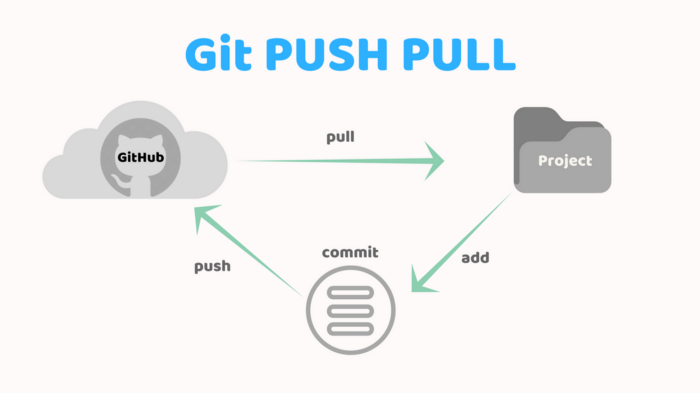{width=50%}

## Exercise 5: Pushing and pulling

The goal of this exercise is to illustrate why it is recommended to regularly pull for changes.

1. Head over to GitHub, open the `my_answers.txt` file, click on the pencil icon, and add a few lines. 

2. Commit your change with the message `add data to my_answers.txt on GitHub`.

3. Open the `my_answers.txt` file on your local machine and add some other data there (don't forget to save the text file!).

4. Run `git status`; it should say that you modified `my_answers.txt`. Therefore, add the file to the staging area (`git add my_answers.txt`), and commit your changes (`git commit -m added some other data my_answers.txt locally`). 

5. So far so good, but what happens once you try to push your changes to GitHub? 

Indeed, you get a message that updates were rejected because the remote contains work that you do not have locally. That is to say, the changes you made to `my_answers.txt` on GitHub are still not available on your local machine. 

__Tip:__ 

- To fix this problem, you simply need to update your local repo with what has already occurred in your GitHub repo using `git pull origin main`. It asks you to enter a commit message to explain why the merge of both changes (locally and GitHub) is necessary. 
- It opens a text editor in the terminal (like you saw before in step 4 of section 1.3). Press `I` to insert text (the lines with `#` will be ignored). Once you're done, press `Esc` and type `:wq` to close the editor and `Enter`. Then, try to push your changes again (`git push origin main`) and refresh the repo on GitHub. Did it work this time? 

\

---

# Part 3: Collaborate on projects using GitHub

So far, you have covered the most basic git workflow: you pull in changes from your collaborators, make some changes in the files yourself, add these changes to the staging area, write a clear commit message, and finally push your changes to GitHub. 

However, Git can do so much more than that. It's a highly sophisticated tool with many bells and whistles for even the most "power users". That's why you're often bombarded with Git commands if you search for them online. Here we highlight a couple of Git's more advanced features which we think are important to know.

\

## Branches
 
With branching, we can create a separate copy of our project code without touching the `main` branch. Each branch is like a parallel universe: changes you make in one branch do not affect other branches (until you merge them back together). This allows us to add new experimental features in separate branches, without touching the "official" stable version of your project code.

By default, every Git repository has a branch called `main` ([previously](https://github.com/github/renaming): `master`). To list all of the branches in a repository, you can run the command:

```
git branch
```

The branch you are currently in will be shown with a `*` beside its name. In this example, there are two branches: `dev` and `master` and we're currently on the `dev` branch:

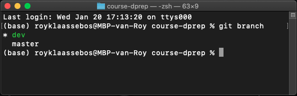{width=40%}
\

You previously used `git checkout` with a commit hash to switch the repository state to that hash. You can also use `git checkout` with the name of a branch to switch to that branch. Again, this only works if all changes on the current branch have been committed.

**Let's try it out!**  

Run `git branch` yourself and see which branch you're currently on. Then, try to go back to the `main` branch  and run `git branch` again to confirm that you switched branches.

In the previous exercise, you used `git checkout <branch-name>` to switch to another branch. You can create a new branch using the following command: 

```
git branch <new-branch-name>
``` 

The contents of the new branch are initially identical to the contents of the original. Once you start making changes, they only affect the new branch. This can be helpful when you're working on different features in your code and have a separate branch for each feature. When you switch to a branch, you can commit code changes which only affect that particular branch. Then, you can switch to another branch to work on a different feature, which won't be affected by the changes and commits made from the previous branch.

Keep in mind that after creating a branch, you still need to switch to the new branch with `git checkout <branch-name>`!

\

## Exercise 6: Branches

Your logs are dependent on the branch you're on

1. Create a new branch `dev` and switch to it (tip: `git checkout -b <branch-name>` creates a branch and changes to it at the same time).

2. Create a text file `my_notes.txt`, insert some placeholder text (e.g., use a [loremipsum generator](https://loremipsum.io/generator/?n=5&t=p)), and save the file in the directory `version-control-exercises`. 

3. Add all files to the staging area and commit your changes (`add notes file`).

4. Run `git log` and look at the most recent commit message. If done correctly, it says `add notes file`. 

5. Switch to the `main branch` and run `git log` again. What's the most recent commit message? Why is that? 

\

It's a good idea to create a *dev* branch where you can work on improving your code and adding new experimental features. After development and testing these new features to make sure they don't have any bugs and that they can be used, you can merge them to the `main` branch.

To merge the changes from a different branch into your current branch, you can use this command:

```
git merge <branch-name>
```

For example, if you're currently on the `main` branch, running `git merge dev` will merge the changes from the `dev` branch into `main`. Git automatically opens an editor so that you can write a log message for the merge; you can either keep its default message or fill in something more informative.

**Let's try it out!**  
Merge the `dev` branch into the `main` one, and commit your changes. After the merge, it's safe to delete the `dev` branch:

```
git branch -d <branch-name>
```

\

On a few occasions, you may run into a so-called *merge conflict*. Let's go over an example: 

The file `todo.txt` initially contains these two lines:

```
A) Write report.
B) Submit report.
```

After committing the file on branch `main`, you create a branch called `dev` and modify the file to be:

```
A) Write report.
B) Submit final version.
C) Submit expenses.
```

You commit the changes again and switch back to the `main` branch. There you delete the first line, so that the file contains:

```
B) Submit report.
```
\

**Let's try it out!**  
Try to replicate the scenario above. You should get the following message: 

```
Auto-merging todo.txt
CONFLICT (content): Merge conflict in todo.txt
Automatic merge failed; fix conflicts and then commit the result.
```

and inside your `todo.txt` you suddenly find some extra markers that indicate where the conflict occurred: 

```
<<<<<<< HEAD
B) Submit report.
=======
A) Write report.
B) Submit final version.
C) Submit expenses.
>>>>>>> dev
```

The top and bottom part refer to the changes from the destination (`main`) and source (`dev`) branches, respectively. Although Git could merge the deletion of line A and the addition of line C automatically, there was a problem with line B. 

**Let's try it out!**  

Resolve the merge conflict by editing the file to manually merge the parts of the file that Git had trouble merging. This may mean discarding either your changes or someone else’s or doing a mix of the two. You will also need to delete the `<<<<<<<`, `=======`, and `>>>>>>>` in the file. The text that you keep, is the text that remains after the merge. Run `git merge dev` again and see whether it still causes a merge conflict.


As a last remark, in section 1.5 you already learned to `push` and `pull` to `origin main`, but you can also push your changes to, for example, the `dev` branch (before merging both branches). Simply, swap `main` for `dev` and you're good to go!

\

**Recap question: What is the main reason we recommend using branches?**

```{r, echo = FALSE}
opts_p <- c(
  "To create a new copy of a repository that everyone can start working on.",
  answer = "To make changes that do not conflict with the main branch and can be merged afterwards.",
  "Because it is mandatory to work with branches when collaborating on a project with others."
)
```

`r longmcq(opts_p)`

\


## Pull Requests

In the previous section, you learned how to push and pull changes when working on the same repository. In many projects, however, changes are not merged automatically. Instead, someone else (for example, a supervisor or project owner) reviews your work first. This is done using a **pull request**.

A pull request is a request to merge your changes into another branch, usually the `main` branch. It allows others to review your changes before they become part of the main project.

A common situation is this:
- you work on changes in your own branch or fork,
- you push those changes to GitHub,
- you then open a pull request to ask for your changes to be reviewed and merged.

At the top of your repository on GitHub, you can click the **Pull request** button:

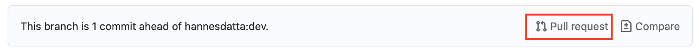{width=80%}

GitHub shows how many commits your version is ahead of the original. It also shows the differences between the files (red = removed, green = added):

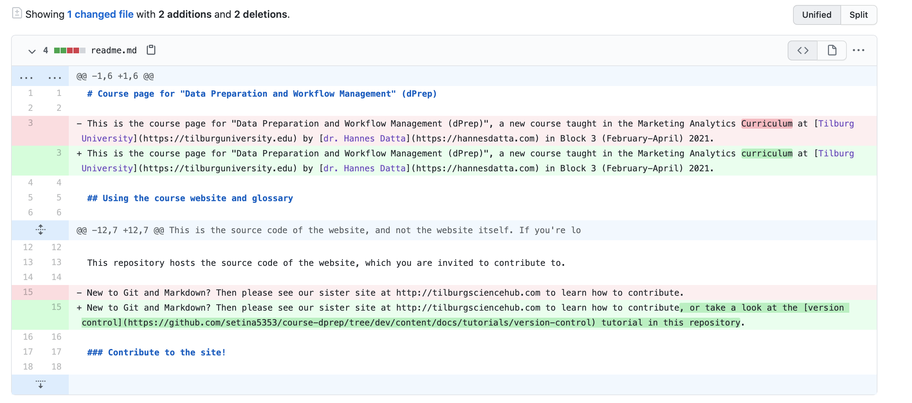{width=80%}

When you click **Create pull request**, you are asked to add a short description explaining your changes:

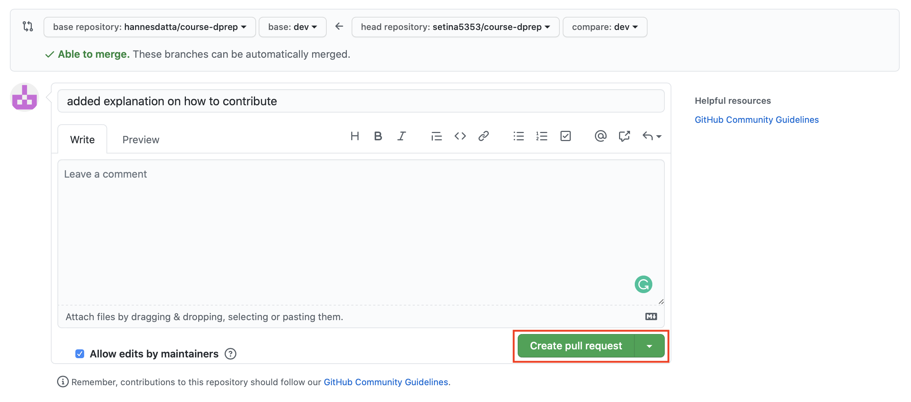{width=80%}

Other collaborators can then review the pull request, comment on the changes, and decide whether to accept them. If everything looks good, they click **Merge pull request** to include your changes in the main branch:

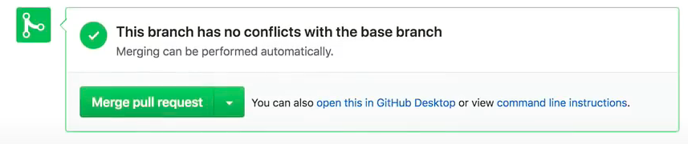{width=40%}

Pull requests are especially important when working in teams or contributing to public projects. They help keep the main branch stable and make collaboration more transparent.

---

## Exercise 7: Create and inspect a pull request

The goal of this exercise is to understand what a pull request looks like and what information it contains.

1. Go to a GitHub repository that you have access to (your own, or a forked one).
2. Make a small change to a file on a branch other than `main` (for example, edit a README).
3. Push the change to GitHub.
4. Open a pull request for your change.
5. Inspect the pull request page:
   - How many commits are included?
   - Which files were changed?
   - What is shown in red and green?

You do not need to merge the pull request. The goal is simply to understand how pull requests connect your changes to the main project.

## Forking Repositories

Sometimes you may want to contribute to a public project of which you don’t know the authors, or you simply want to use it as a starting point for your own project. This process of creating a copy of someone else's project is called *forking*.

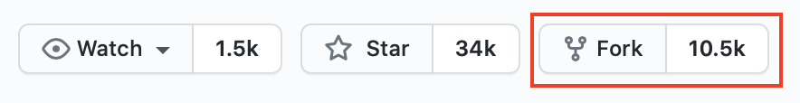{width=40%}

Thus, a *fork* is your personal copy of a repository owned by someone else. So, over 10K other GitHub users have made a copy of [this](https://github.com/deepfakes/faceswap) popular Facebook FaceSwap project. 

\


## Restoring work

**Importance**  
Do you recall the Google docs example we discussed earlier? Also, Git has a version control history feature built-in, or to be more precise: an overview of all past commits. In the top right corner of your GitHub repository, you find the following: 
`<some number> on <date> <number commits>`. Here's an example for this [course repository](https://github.com/hannesdatta/course-dprep/commits/dev):
\

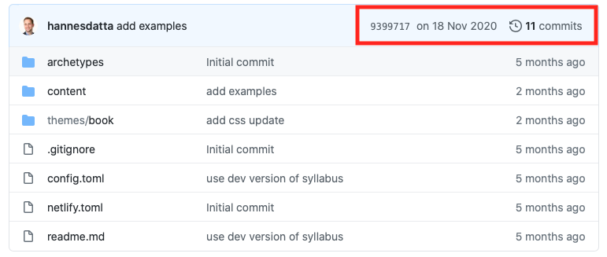{width=50%}

\
Once you click on 11 commits here, it shows a chronologically ordered list of all historic commit messages, the author, and a unique id (e.g., `0ae104b`). You can click on each of these commits to get a side-by-side comparison of the changes (red = deleted, green = added). 

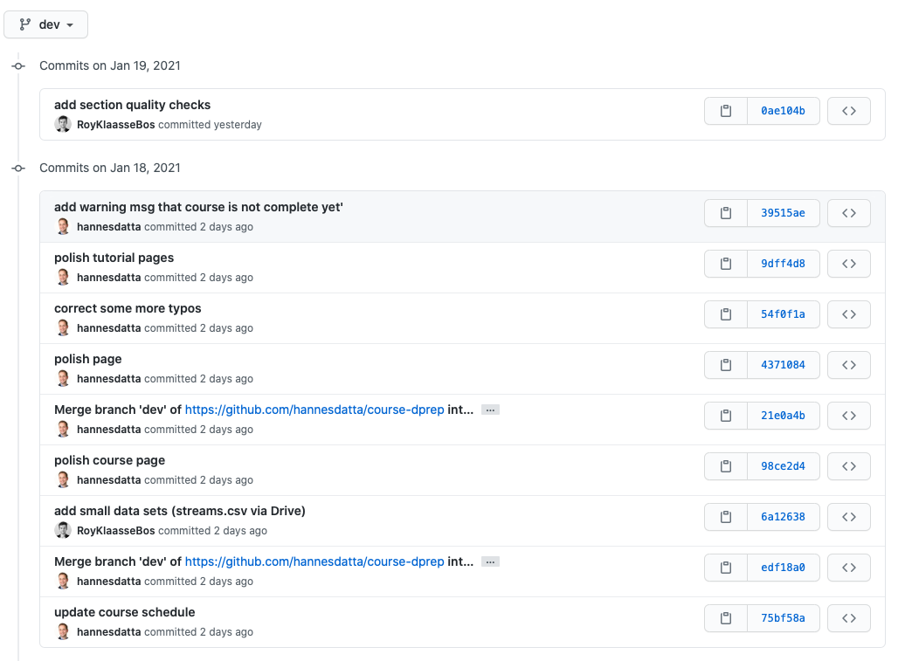{width=50%}

**Let's try it out! When was the first commit on the dev branch and what was done?**

```{r, webex.hide = 'Solutions',include=show_solutions}
#The first commit was on 2 September 2020 and was called "Initialize dev"
```

We can access the same list of commits through our terminal. `cd` into the respective Git directory and run `git log` to view the log of the project's history. Every time, you press the space bar it moves down the list (so you see older commit messages).  Log entries are shown most recent first, and look like this:

```
commit 9dff4d8e3d7b5aba0082b1c6e115a9e7ffd4339c
Author: Hannes Datta <h.datta@tilburguniversity.edu>
Date:   Mon Jan 18 22:03:52 2021 +0100
    polish tutorial pages
```
    
The long string of characters on the first line is called a hash (or SHA). This hash is normally written as a 40-character hexadecimal string like `9dff4d8e3d7b5aba0082b1c6e115a9e7ffd4339c`, but most of the time, you only have to give Git the first 8 characters in order to identify the commit you mean.


**Let's try it out!**  
Run `git log` in your own repository. What is the hash of your first commit? If there are many commit messages, you can exit the log history by pressing `Esc` followed by `Enter` and finally `q` (quit). 

\

## Exercise 8: Restoring work

Suppose that we accidentally removed the `my_answers.txt` file and want to restore it in our repository. This exercise shows you how to do that. 

1. Remove the `my_answers.txt` file from `version-control-exercises` (trust us, you can even empty your trash can!)

2. Look up the hash of the commit in which the file was still present (`git log`) and copy the SHA (Cmd + C / Ctrl + C). 

3. Run `git checkout <SHA>` and inspect your directory. Is the `my_answers.txt` file there, again? 

If you followed the steps above, you probably got the message below. It means that Git switched to another branch, but that our original work - before running `git checkout` - still resides on another branch. In the next section, we explain the applications of branches and how you can switch between them.

```
Note: switching to '<SHA>'.
You are in 'detached HEAD' state. You can look around, make experimental
changes and commit them, and you can discard any commits you make in this
state without impacting any branches by switching back to a branch.
If you want to create a new branch to retain commits you create, you may
do so (now or later) by using -c with the switch command. Example:
  git switch -c <new-branch-name>
```

# Conclusion

Throughout this section, you have learned a variety of Git commands and workflows. If you put them into practice, you never have to worry about losing or overwriting your work. All your changes are captured, and you can always go back to a previous state. And now that you have an understanding of forking and pull requests, we highly encourage you to take a look at some [popular Gitub](https://github.com/trending) repositories and maybe even make some contributions yourself!

\

## Important Git Commands 

| Command | Use | 
| :----- | :---- | 
| `git clone <URL>` | Makes a clone of the repository at the specified URL (never clone a repository into another repository!) |
| `git status` | Outputs status, including what branch you are on and what changes are staged | 
| `git add .` | Adds all changes to the staging area to be committed |
| `git add <file_name>` | Adds changes to the specified file to the staging area to be committed | 
| `git commit` | Commits staged changes and allows you to write a commit message | 
| `git push origin <branch_name>` | Pushes local changes to the specified branch of the online repository | 
| `git pull origin <branch_name>` | Pull changes from the online repository into local repository | 
| `git log` | Outputs a log of past commits with their commit messages | 
| `git checkout -b <branch_name>` | Creates and switches to a new branch | 
| `git checkout <branch_name>` | Switches to the specified branch | 
| `git merge <branch_name>` | Merges the branch you are on into the specified branch | 

Please also view the [summary of Git commands](https://dprep.hannesdatta.com/docs/building-blocks/automation/git/), and the various [Git cheatsheets on the course website](https://dprep.hannesdatta.com/docs/building-blocks/cheat-sheets/).


## Frequently Asked Questions

* *How do I delete a repository?*   
Go to "Settings" and scroll down to the bottom of the page. There you find a "Danger Zone" which allows you to delete a repository (but also to make a private repository public).

* *Can I collaborate with others without making my repository public?*  
Yes, you can create a private repository and add collaborators on GitHub via "Settings" > "Manage Access" > "Invite a collaborator".

* *I accidentally uploaded a file to GitHub which I want to remove. How do I fix this?*  
`cd` into the directory that contains the file and remove it with the command `rm <filename>` or `rm -rf <folder>` if it's a folder. Then, add, commit, and push your changes, and the file should be gone.

* *Git takes very long to push my changes. Why is that?*   
While you can add a variety of files to your GitHub repository, Git is a tool for version control of code. These files with code (e.g., R Markdown) are usually rather small in size and can be easily processed. It is, however, not meant for version control of your data. Although you can add files up to 100 MB, we recommend fetching large files in other ways because pushing and pulling changes will be much faster. That's because a repository contains every version of every file. So, if you commit a `data.csv` of 50 MB twice it already takes up 100 MB! Git LFS allows you to version large files while saving disk space and cloning time using the same Git workflow that you're used to. Contrary to Git, it does not keep all your project's data locally. In [this](http://tilburgsciencehub.com/git-lfs/) tutorial we walk you through the steps on how to get started with it.

\

## More practice!

It can be daunting to get started using Git commands. But there's help:

> At [learngitbranching.js.org](https://learngitbranching.js.org), you get access to an interactive web app that takes you through learning how Git works on the command line. It's difficult, but rewarding!
>
> If you decide to practice more, we recommend following these sections:
>
> - Main: Introduction Sequence
> - Remote: Push & Pull, and "To Origin and Beyond"

Further Learning:

* [Simple Guide to Forks in GitHub and Git](https://www.dataschool.io/simple-guide-to-forks-in-github-and-git)
* [Guide for Reproducible Research](https://the-turing-way.netlify.app/reproducible-research/vcs.html)
* [Git official documentation](https://git-scm.com/doc)
* [Free Git Pro book](https://git-scm.com/book/en/v2)


<!--

### Prerequisites

* Get familiar with the shell/terminal/command line
  * [DataCamp Introduction to Shell](https://datacamp.com/courses/introduction-to-shell) (chapter 1; for Mac & Windows users) 
  * [How To Use The Command Line](https://generalassembly.github.io/prework/cl/#/) (optional - only for Mac users)
* Installation
  * Download and install the latest version of [Git](https://git-scm.com/downloads) (Mac users first need to install [homebrew](https://brew.sh/)).
  * There's an extra tool - called GitHub CLI - which makes many steps in Git easier. Install it [here](https://cli.github.com/).


--->
