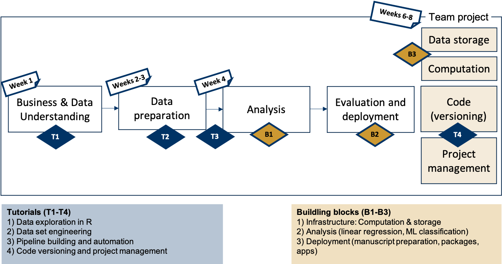

% Data Preparation and Workflow Management
% [Hannes Datta](https://hannesdatta.com)

# Live stream #3

## Hi there!

Please turn on your camera :)

The chat is open - use it like on Twitch/YouTube to also talk to each other; use prefix `???` to ask a question to me!

Fill in the getting-started-poll on Zoom!

## Agenda and Goals

- Checking in & updates
- Recap from last week
- Part 1: Data Preparation & ITO blocks
- Part 2: Tutorial walkthrough & Q&A
- Outlook/next steps

::: notes

Questions for Poll:
- I'm tired from the day
- I want this to be a very active sessions, break out groups & activtiies
- I rather want to consume

- I'm advanced
- I'm an absolute beginner

----

- Borrel at 5pm
- Twitch livestreams: https://www.twitch.tv/sjoerdmerx/
  - Need to "look at each other's screens"
  - why great? learn from each other, build an audience, make learning fun!
- Use of TeamViewer: please install/have available in the session: http://tilburgsciencehub.com/building-blocks/configure-your-computer/automation-and-workflows/teamviewer/. Send ID number and password via WhatsApp if requested
- I'll share some learnings from your questions
- I'll share my screen/show you how I code, so you can learn from it (truth to be told: I don't use dplyr)

- "Proof of skill investment"
  - Upload HTML-versions of Markdown documents to Canvas, before 14.15 on the day of the tutorial
  - Affects "peer assessment" component of team grade
  - Late submissions accepted up to a week later

:::

## Comment on teaching style

> - I don't give "traditional lectures"
- Instead, I put most effort in the *tutorials* and other relevant study resources - these are all online
- Live streams are way to help you see the bigger picture, but they are *absolutely insufficient* in replacing all of the study material
- Use feedback via WhatsApp, livestreams, be active & get the most of this course (can still adapt)
- Really enjoy it so far - hope you do, too!

## Disclaimer

- We use `dplyr` today - but I don't use that for my research (instead, I use `data.table`)
- I'm starting out, too - so you can observe me learning

# Part 1: Data preparation

## Where we're going with this...

::: notes

It may be hard for you to realize what the initial stages mean, so I want to show it to you in one of my projects.

In this paper, I study [...]

1. Getting to know the data & some initial auditing
2. Data preparation - I do this in this stage, consists of many files
3. Analysis - quite complex
4. Deployment - web app

Each phase is different - getting to know may be some initial explorations, etc.  - THAT's WHAT YOU DID LAST WEEK!
  - trying out how to read in data
  - looking at some initial plots
  - generating an RMarkdown

Data prepartion: today's focus, but also so many flavors

Analysis - regression, machine learning

Various ways of deployment.

:::

## Motivation

Why do you need to prepare data for analysis?

https://www.youtube.com/watch?v=z_Hh1jlL1Ac

## The "ITO" building block

- Input (e.g., files, data from databases)
- Transformation (data wrangling, e.g., merging, filtering, sorting)
- Output (e.g., files, data to databases, apps, dashboards, APIs)

## Implementation

- Two groups
  - "Breakout challenge" <- advanced users
  - One guided group: stays here

- Task: see activity for this module, online: https://dprep.hannesdatta.com/docs/course/modules/week3/activity/
  - Can choose between several tasks (1 is easiest, 3 hardest)

## Work on challenge now

## Sharing experiences from breakout groups

## Zooming in on inputs and outputs

::: notes

Switch to my tablet now...

Start with Kannan: Characterizing big data

2x2 with data

:::

## Planning a data preparation

- Can consist of multiple "ITO" blocks
- We learn to stitch those together in module 3

## Example project: Spotify (I)

- Paper: tiu.nu/spotify

- Get data
  - API: users - timestamp consumption
  - Scraper: username - timestamp - platform
- Data preparation
  - Stitch together with approximate merge
  - Merge artist meta characteristics
  - Tag "new" artists
  - Filter: only users that used iTunes at the beginning

## Example project: Spotify (II)

- Feature-engineering & aggregation per week
  - Total consumption
  - New consumption/artists
  - Concentration metrics
- Analyze (diff-in-diff)

## Wrap up of part 1

>- Need for preparing data for analysis
- Think in input-transformation-output blocks
- Stitch them together in a pipeline

# Part 2: Zooming in on transformation

## Cheat sheet for `dplyr`

https://dprep.hannesdatta.com/docs/building-blocks/cheat-sheets/

## Tutorial Q&A

## Key idea 1: Limit data size

## Key idea 2: Use packages

- e.g., `data.table` or `dplyr` for loading and wrangling

## Key idea 3: Use cheat sheets

## Key idea 4: Using stackoverflow

## Next week: Self-study

- Reading on "workflow" management
- Catching up with tutorials & becoming proficient

## Any questions?

Stick around now if you have questions.

(e.g., installation issues, prep week)

::: notes

* can use the break for installation problems
* show on the website where they can find the information they need
* how to download the files (right click)
* manage expectations: DataCamp courses are simplistic (copy-paste etc.) and should not take too long, the data challenges are more challenging and will likely take more time, and are more representative of the level we expect in this course.

:::

## Contact

Thanks a lot, and have fun with the course!

Hannes Datta

https://hannesdatta.com
